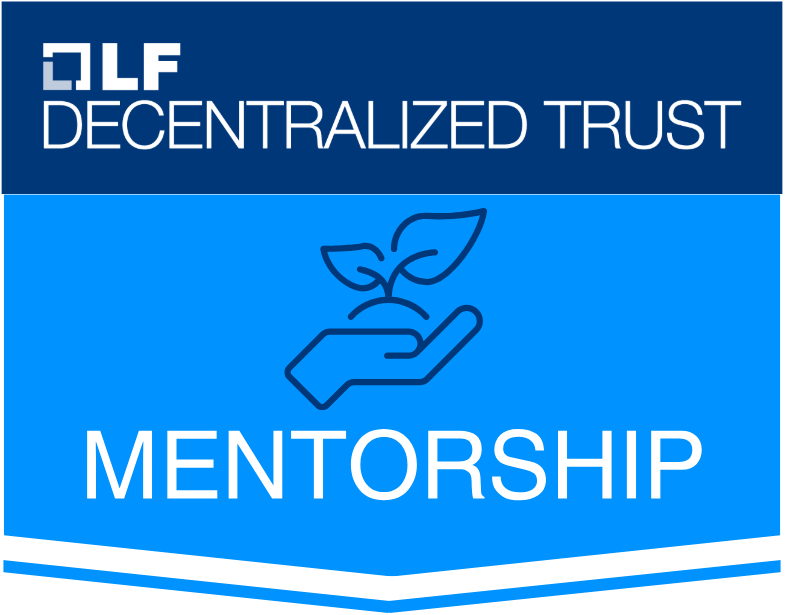

<div align="center">
<picture>
<source media="(prefers-color-scheme: dark)" srcset="public/caracal_nobg_dark_mode.png">
<source media="(prefers-color-scheme: light)" srcset="public/caracal_nobg.png">

</picture>
</div>

<div align="center">

**Security-first authority and delegation system for AI agents**
</div>

<div align="center">

[](LICENSE)
[](https://github.com/Garudex-Labs/caracal/releases)
[](https://github.com/Garudex-Labs/caracal)
[](https://caracal.run)

[](https://www.bestpractices.dev/projects/12350) 
[](https://scorecard.dev/viewer/?uri=github.com/Garudex-Labs/caracal) 
[](https://codecov.io/github/garudex-labs/caracal)
</div>

-----

# Overview

**Caracal** is an authority plane for operating AI agents safely in real environments. It solves a concrete platform problem: agents need access to tools, APIs, and providers, but platform teams need that access to be scoped, short-lived, revocable, and auditable without placing provider secrets inside agent code.

The default product path is intentionally small: register an **agent app**, run an **agent run**, request a short-lived **mandate**, call a **resource** through the **Gateway**, and inspect the resulting **audit** trail. The STS evaluates policy and issues Caracal access tokens, the Gateway enforces token validity and provider routing, the Coordinator tracks runtime and delegation state, and Audit records why access was allowed or denied and what happened upstream.

-----

## Start Here

For a basic OSS integration, follow the docs path:

1. [Install Caracal](docs/src/content/docs/get-started/installation.mdx)
2. [Run the local stack](docs/src/content/docs/get-started/quickstart.mdx)
3. [Ship a first Gateway-backed integration](docs/src/content/docs/get-started/first-integration.mdx)
4. [Configure runtime credential injection](docs/src/content/docs/runtime-console/config-file.mdx) with platform env/secret files or a local `caracal.toml` profile

Use the Gateway path first. SDK middleware binds already-verified Caracal context for propagation; protected inbound routes should use Gateway or a verifier connector.

-----

## Community

<div align="center">
<table>
<tr>
<td align="center">
<a href="https://www.youtube.com/live/tZ4FdO-zjeE" target="_blank" rel="noopener">
<br>
<strong>GitHub's Open Source Friday</strong>
</a>
</td>
<td align="center">
<div style="width:320px;height:180px;display:flex;align-items:center;justify-content:center;border-radius:6px;border:1px solid #ddd;background:#f8f8f8;font-weight:600">
More coming soon
</div>
</td>
</tr>
</table>
</div>

</div>

<div align="center">
</div>

-----

## Installation & Setup

<details>
<summary><strong>End Users</strong></summary>

### Prerequisites

- Docker Desktop 4.x or Docker Engine 24+ with Compose v2
- Git 2.x

### Install

The installer provides the thin `caracal` runtime shell and the `caracal-console` management interface.

> Pin a version: `--version vYYYY.MM.DD` on Unix or `-Version vYYYY.MM.DD` in PowerShell.  
> Change install directory: `--install-dir /path` on Unix or `-InstallDir C:\path` in PowerShell.

<details>
<summary><strong>Linux</strong> (amd64 / arm64)</summary>

```bash
# Console
curl -fsSL https://raw.githubusercontent.com/Garudex-Labs/caracal/main/install-console.sh | sh
```

Installs to `~/.local/bin`. Override with `--install-dir /usr/local/bin` (may need `sudo`).

</details>

<details>
<summary><strong>macOS</strong> (Intel / Apple Silicon)</summary>

```bash
# Console
curl -fsSL https://raw.githubusercontent.com/Garudex-Labs/caracal/main/install-console.sh | sh
```

If Gatekeeper blocks the binary: `xattr -d com.apple.quarantine ~/.local/bin/caracal`.

</details>

<details>
<summary><strong>Windows</strong> (amd64) PowerShell</summary>

```powershell
# Console
iwr -useb https://raw.githubusercontent.com/Garudex-Labs/caracal/main/install-console.ps1 | iex
```

Installs to `%LOCALAPPDATA%\Programs\caracal`. Requires Docker Desktop with WSL2.

</details>

### Start the stack

```bash
caracal up                            # start all services, override with `CARACAL_VERSION=vYYYY.MM.DD caracal up`
caracal status [--ready]              # probe all services
caracal down                          # stop; add -v to remove volumes
caracal purge                         # interactive cleanup (containers, volumes, config, runtime, caches)
caracal console                       # Launch Interface
caracal run -- node worker.js         # workload execution
```

</details>

<pr></pr>

<details>
<summary><strong>Contributors</strong></summary>

### Prerequisites

- Node.js 24+
- pnpm 10+
- Docker Engine 24+ with Compose v2 (or Docker Desktop 4.x)
- Git 2.x
- Go 1.26+ (only when changing Go services or shared Go packages)
- Python 3.14+ (only when changing Python packages)
- Bun (only when building distributable runtime/console binaries)

See [CONTRIBUTING.md](CONTRIBUTING.md) for clone, setup, testing, and pull request workflow.

</details>

-----

## Maintainers

<table width="100%">
  <tr align="center">
    <td valign="top" width="33%">
      <a href="https://github.com/RAWx18" target="_blank">
        <br/>
        <strong>RAWx18</strong>
      </a>
      <p>
        <a href="https://github.com/RAWx18" target="_blank">
          
        </a>
        <a href="https://linkedin.com/in/ryanmadhuwala" target="_blank">
          
        </a>
      </p>
    </td>
    <td valign="top" width="33%">
      <a href="https://github.com/yashgo0018" target="_blank">
        <br/>
        <strong>yashgo0018</strong>
      </a>
      <p>
        <a href="https://github.com/yashgo0018" target="_blank">
          
        </a>
        <a href="https://www.linkedin.com/in/yash-goyal-0018" target="_blank">
          
        </a>
      </p>
    </td>
    <td valign="top" width="33%">
      <a href="https://github.com/Slo-Pix" target="_blank">
        <br/>
        <strong>Slo-Pix</strong>
      </a>
      <p>
        <a href="https://github.com/Slo-Pix" target="_blank">
          
        </a>
        <a href="https://www.linkedin.com/in/shubh465" target="_blank">
          
        </a>
      </p>
    </td>
  </tr>
</table>

-----

## Contributing

See [CONTRIBUTING.md](CONTRIBUTING.md) for setup, workflow, tests, and pull request standards.

-----

## Programs

<div align="center">
  <div style="display:flex;align-items:center;gap:24px;flex-wrap:wrap;justify-content:center;max-width:960px;">
    <a href="https://mentorship.lfx.linuxfoundation.org/project/9cfe285b-7006-4610-84a8-1a52b0dff662" target="_blank" rel="noopener">
      
    </a>
    <div style="max-width:520px;text-align:left;">
      <p style="margin:0;">This project is part of the <a href="https://mentorship.lfx.linuxfoundation.org/project/9cfe285b-7006-4610-84a8-1a52b0dff662" target="_blank" rel="noopener">LFX Mentorship 2026</a> program under the <a href="https://www.lfdecentralizedtrust.org" target="_blank" rel="noopener">LF Decentralized Trust</a> organization, improving security and open source awareness.</p>
    </div>
  </div>
</div>

-----

## License

Caracal is open-source software licensed under the **Apache-2.0** License. See the [LICENSE](LICENSE) file for details.

**Developed by Garudex Labs.**
