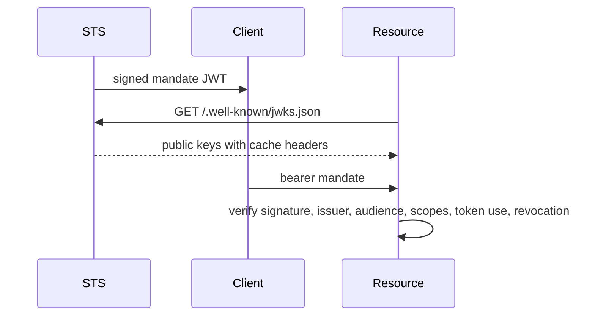

Caracal uses separate keys for encryption, mandate signing, audit integrity, stream integrity, and service-to-service exchange.

## Key map

| Material | Used by | Purpose |
| --- | --- | --- |
| Zone signing keys | STS | Sign mandate JWTs and publish public keys through JWKS. |
| `ZONE_KEK` | API and STS | Encrypt/decrypt zone secrets and key material. |
| `AUDIT_HMAC_KEY` | API, STS, Gateway, Audit, Control | Protect audit event integrity. |
| `STREAMS_HMAC_KEY` | API, STS, Gateway, Coordinator, Audit/consumers | Sign Redis stream messages in published modes. |
| `GATEWAY_STS_HMAC_KEY` | Gateway and STS | Authenticate Gateway token-exchange requests to STS. |
| Admin and Coordinator tokens | API, Coordinator, Console, Control | Authenticate management and agent/delegation operations. |

## Mandate verification

STS JWKS responses are cacheable; rotation plans must preserve overlap until verifier caches expire.

## Gateway exchange signature

Gateway signs STS exchange requests with timestamp, request ID, method, path, and form body. STS checks the signature, skew, request ID, and nonce before accepting the Gateway-authenticated path.

## Published-mode requirements

In `rc` and `stable`, HMAC keys used by services must be present and at least 32 bytes where validated. Missing keys cause startup or readiness failure rather than silent downgrade.

## Related pages

- [Key Management and Rotation](/operations/key-management/)
- [Identity Package](/sdks/identity/)
- [Trust Boundaries](/architecture/trust-boundaries/)
