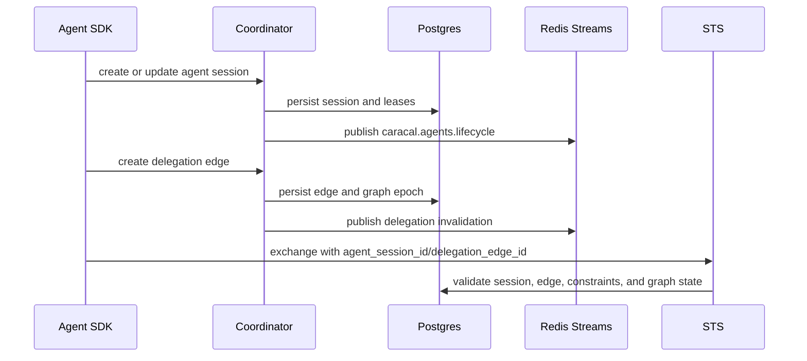

Coordinator owns agent runtime state. It records agent sessions, service leases, invocation lifecycle, and delegation edges that STS later uses to validate delegated exchanges.

## Flow

## Coordinator State

| State | Purpose |
| --- | --- |
| `agent_sessions` | Agent session tree, parent-child relationships, status, leases, and root subject session. |
| `agent_services` | Service agents and heartbeat health. |
| `delegation_edges` | Source/target sessions, resource/scope bounds, expiry, constraints, and status. |
| `agent_invocations` | Invocation lifecycle and deadline tracking. |
| `delegation_graph_epochs` | Graph invalidation and traversal consistency. |
| `caracal_outbox` | Durable event publication for Coordinator-produced topics. |

## Event Topics

| Topic | Meaning |
| --- | --- |
| `caracal.agents.lifecycle` | Agent session lifecycle. |
| `caracal.invocations.lifecycle` | Invocation lifecycle. |
| `caracal.delegations.invalidate` | Delegation graph invalidation. |
| `caracal.sessions.revoke` | Session, agent, and delegation revocation propagation. |

## Operator Boundaries

Human operators use Console `agent session` and `delegation` views. Automation uses Coordinator API/Admin SDK surfaces. Top-level `caracal` runtime commands do not manage agent sessions or delegation.

## Next Step

Use [Propagate Events](/architecture/event-streams/) to understand how lifecycle, invalidation, revocation, and audit messages move.

## Related Pages

- [Coordinator Service](/services/coordinator/)
- [Agent Delegation](/concepts/delegation/)
- [Manage Agents and Delegation](/runtime-console/agents/)
