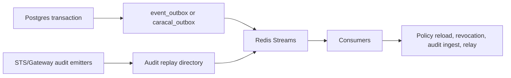

Caracal uses Postgres outboxes for durable enqueue and Redis Streams for asynchronous delivery. Published modes sign stream messages with `STREAMS_HMAC_KEY`.

## Event Pipeline

## Streams

| Stream | Producers | Consumers |
| --- | --- | --- |
| `caracal.audit.events` | API, STS, Gateway, Coordinator, Control | Audit `audit-ingestor`, SIEM exporters |
| `caracal.audit.events.dlq` | Audit | DLQ observers |
| `caracal.policy.invalidate` | API | STS policy loader |
| `caracal.sessions.revoke` | API/Coordinator | STS and resource/Gateway revocation consumers |
| `caracal.keys.invalidate` | API/STS | STS key caches |
| `caracal.agents.lifecycle` | Coordinator | Coordinator relay |
| `caracal.invocations.lifecycle` | Coordinator | Invocation observers |
| `caracal.delegations.invalidate` | Coordinator | Delegation observers |
| `caracal.providers.ratelimit` | Redis provisioner/provider coordination | Provider rate-limit coordination |

## Outbox Behavior

| Outbox | Owner | Behavior |
| --- | --- | --- |
| `event_outbox` | API | Durable enqueue inside API transactions, cooperative dispatcher, signed Redis `XADD`, retry/backoff, dead-row metrics. |
| `caracal_outbox` | Coordinator | Dedupe by producer/topic/dedupe key and publishes Coordinator topics. |

## Audit Replay

STS and Gateway use replay directories under `/var/lib/caracal/audit-replay`. When Redis or Audit is unavailable, replay files preserve pending audit events so they can drain after recovery.

## Next Step

Use [Store State](/architecture/storage-model/) to understand which data is durable, transient, or recoverable.

## Related Pages

- [Operate Redis Streams](/operations/redis/)
- [Audit Service](/services/audit/)
- [Event Topics](/api/event-topics/)
