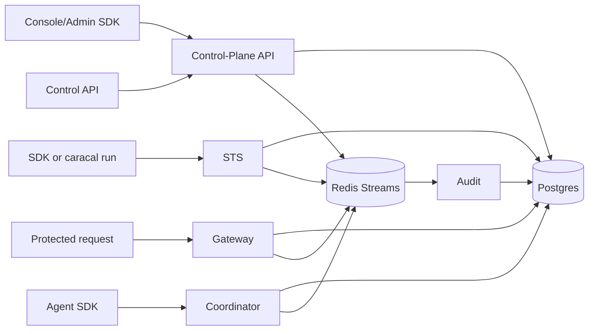

Caracal is a pre-execution authority system for AI agents. It separates control-plane management, token exchange, protected-resource routing, audit evidence, and agent/delegation coordination into independent services backed by Postgres and Redis Streams.

## System at a glance

## Core design choices

| Choice | Effect |
| --- | --- |
| Postgres as source of truth | Product state, policy versions, grants, sessions, audit rows, agents, delegations, and outboxes are durable. |
| Redis Streams for propagation | Audit, invalidation, revocation, key, agent, invocation, and delegation events move asynchronously. |
| STS for mandate issuance | Every protected access path receives a scoped, short-lived mandate. |
| Gateway for protected upstreams | Gateway verifies inbound authority, exchanges with STS, blocks unsafe routing, and emits audit evidence. |
| Coordinator for agent authority | Agent sessions, service leases, delegation edges, and invocation lifecycle stay explicit. |
| Console/API boundary | Human management uses Console; automation uses Control/Admin APIs; runtime shell remains lifecycle-only. |

## Reading path

1. [System Topology](/architecture/system-topology/)
2. [Token Exchange Flow](/architecture/token-exchange-flow/)
3. [Delegation and Coordinator Flow](/architecture/delegation-flow/)
4. [Event Streams and Outbox](/architecture/event-streams/)
5. [Storage Model](/architecture/storage-model/)
6. [Cryptography and Keys](/architecture/crypto-keys/)
7. [Trust Boundaries](/architecture/trust-boundaries/)

For service-by-service detail, continue to [Services](/services/). For deployment detail, use [Operations](/operations/).
