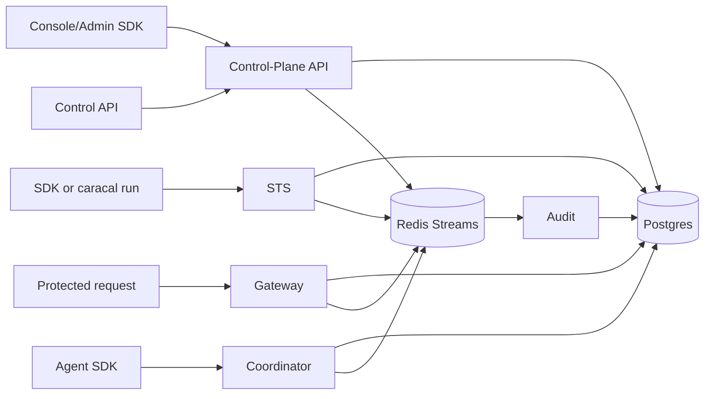

Caracal is a pre-execution authority system for AI agents. It separates control-plane management, token exchange, protected-resource routing, audit evidence, and agent/delegation coordination into independent services backed by Postgres and Redis Streams.

## System Overview

## Core Design Choices

| Choice | Effect |
| --- | --- |
| Postgres as source of truth | Product state, policy versions, grants, sessions, audit rows, agents, delegations, and outboxes are durable. |
| Redis Streams for propagation | Audit, invalidation, revocation, key, agent, invocation, and delegation events move asynchronously. |
| STS for mandate issuance | Every protected access path receives a scoped, short-lived mandate. |
| Gateway for protected upstreams | Gateway verifies inbound authority, exchanges with STS, blocks unsafe routing, and emits audit evidence. |
| Coordinator for agent authority | Agent sessions, service leases, delegation edges, and invocation lifecycle stay explicit. |
| Console/API boundary | Human management uses Console; automation uses Control/Admin APIs; runtime CLI remains lifecycle-only. |

## System Flows

| Need | Page |
| --- | --- |
| Identify services, clients, and dependencies | [Map the System](/architecture/system-topology/) |
| Understand STS mandate issuance | [Exchange Tokens](/architecture/token-exchange-flow/) |
| Understand agent sessions and delegation | [Coordinate Agents](/architecture/delegation-flow/) |

## State and Safety

| Need | Page |
| --- | --- |
| Understand Redis Streams and outboxes | [Propagate Events](/architecture/event-streams/) |
| Understand durable data ownership | [Store State](/architecture/storage-model/) |
| Understand signing, HMACs, JWKS, and rotation | [Manage Keys](/architecture/crypto-keys/) |
| Understand security and command boundaries | [Enforce Boundaries](/architecture/trust-boundaries/) |

## Next Step

Start with [Map the System](/architecture/system-topology/) before tracing request and state flows.

For service-by-service detail, continue to [Services](/services/). For deployment detail, use [Operations](/operations/).
