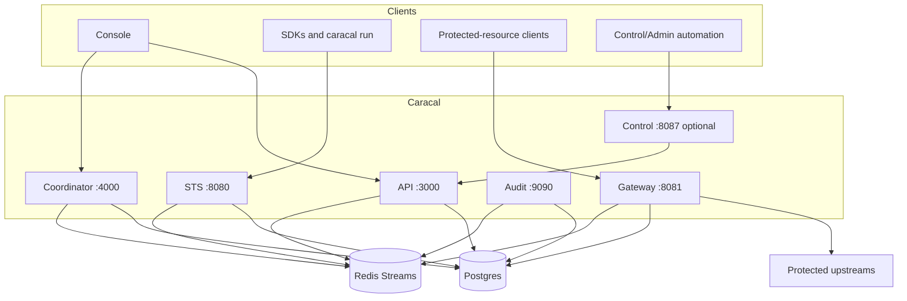

Caracal has six primary HTTP services plus Postgres and Redis.

## Topology

## Service Responsibilities

| Service | Responsibility |
| --- | --- |
| API | Zones, applications, providers, resources, policies, policy sets, grants, step-up challenges, admin audit, and API outbox. |
| STS | OAuth token exchange, mandate issuance, policy evaluation, JWKS, step-up status, policy simulation, signing-key rotation internals. |
| Gateway | Protected reverse proxy, inbound mandate verification, per-request STS exchange, SSRF guard, revocation checks, audit replay. |
| Audit | Redis audit ingestion, DLQ, tamper checks, retention, search, metrics. |
| Coordinator | Agent sessions, agent services, delegations, invocations, sweeper jobs, Coordinator outbox. |
| Control | Optional remote management invoke endpoint gated by token auth, replay protection, rate limiting, and runtime gate file. |

## Deployment Shapes

| Shape | Source |
| --- | --- |
| Local development | `infra/docker/docker-compose.yml` through `caracal up`. |
| Self-hosted Compose | `infra/docker/runtime-compose.yml`. |
| Kubernetes | `infra/helm/caracal`. |

## Next Step

Use [Exchange Tokens](/architecture/token-exchange-flow/) to follow how workloads receive scoped mandates.

## Related Pages

- [Services](/services/)
- [Deploy with Docker Compose](/operations/docker-compose/)
- [Deploy with Helm](/operations/kubernetes-helm/)
