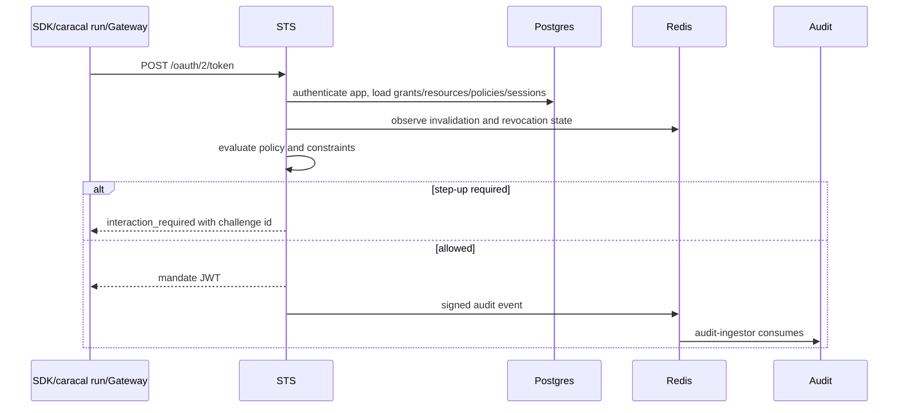

STS implements the token exchange boundary. Workloads, SDKs, `caracal run`, and Gateway submit existing authority plus requested resources and receive scoped mandates.

## Exchange sequence

## Inputs

| Input | Purpose |
| --- | --- |
| `grant_type` | OAuth token-exchange request type. |
| `subject_token` | Existing user, service, application, or agent authority. |
| `actor_token` | Optional actor authority for delegated exchange. |
| `resource` | Target resource identifiers. |
| `scope` | Requested resource scopes. |
| `zone_id` | Tenant boundary. |
| `application_id` and client credential | Authenticates the calling application. |
| `session_id`, `agent_session_id`, `delegation_edge_id` | Authority anchors for session/delegation checks. |
| `challenge_id` / `challenge_response` | Step-up completion. |

## Current TTL contracts

| Mandate type | Contract |
| --- | --- |
| Resource mandate | Capped at 15 minutes. |
| Session mandate | Capped at 60 minutes. |
| Runtime-injected credential | `caracal run` injects credentials capped at 15 minutes after STS exchange. |

Gateway performs a per-request exchange and rejects inbound tokens that are too close to expiry before proxying.

## Gateway-authenticated exchange

Gateway exchanges with STS using a request signature, timestamp, and nonce over the token exchange request. STS verifies the Gateway HMAC key and consumes the nonce before trusting the Gateway-authenticated path.

## Related pages

- [STS Service](/services/sts/)
- [Mandate](/concepts/mandate/)
- [Step-Up Challenge](/concepts/step-up/)
- [STS Token Endpoint](/api/sts/)
