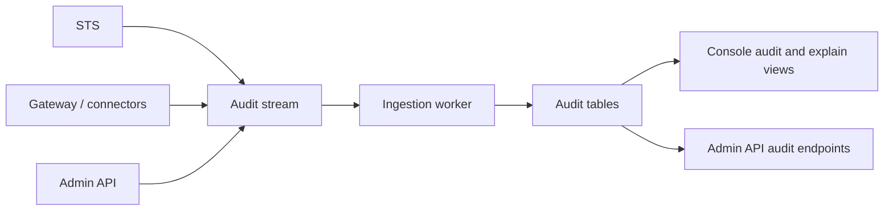

The audit ledger records what Caracal decided, why it decided it, and which request or run produced the event.

## What gets audited

| Event area | Examples |
| --- | --- |
| Token exchange | Allow, deny, step-up required, policy diagnostics. |
| Gateway and connector use | Resource decision, mandate verification failure, request correlation. |
| Policy lifecycle | Policy creation, validation, policy-set activation, simulation. |
| Delegation | Edge creation, traversal, impact, revocation cascade. |
| Sessions | Spawn, terminate, revoke, expire. |
| Administration | Zone, application, resource, provider, grant, invitation, and challenge changes. |

## Audit flow

## How to use audit

| Question | Where to look |
| --- | --- |
| Why was a request denied? | Console `explain` or Admin API explain endpoint by request ID. |
| Which policy caused the decision? | Determining policies and diagnostics. |
| Did revocation propagate? | Session, delegation, and resource decision events. |
| Which run made a request? | Request ID, session ID, agent session ID, and trace context. |
| Was step-up required or satisfied? | Step-up challenge and exchange events. |

## Request IDs

Request IDs tie multiple events together. Keep the request ID from an SDK, Gateway, STS error, or Console trace whenever debugging. The explain view uses it to collect related decision events and diagnostics.

## Integrity and retention

Audit events should be treated as operational evidence. Configure retention, export, and SIEM forwarding according to your deployment requirements. Do not rely on local process logs as the only authority trail.

## Related pages

- [Tail and Query the Audit Stream](/guides/audit-stream/)
- [Inspect a Run](/tutorials/inspect-a-run/)
- [Operations](/operations/)
