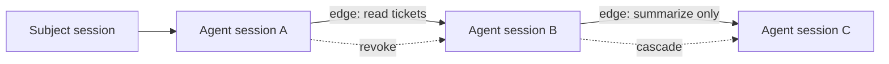

Delegation lets one agent session pass a narrower, typed slice of authority to another agent session.

Authority follows the **application**. Agents you spawn under the same application already act under that application's authority — no delegation edge is needed for ordinary fan-out. You create a delegation edge in exactly two cases:

- To **narrow** authority, so a child holds only a subset of what its parent can do (least privilege).
- To carry authority **across applications**, when the receiver is a different application that must consent.

It is represented as a graph of directed edges. Each edge connects a source session to a target session, carries scopes and constraints, and can be revoked independently.

## Graph Model

## Delegation Edge Fields

| Field | Purpose |
| --- | --- |
| Source session | The session that delegates authority. |
| Target session | The child or receiving agent session. |
| Issuer application | Application creating the delegation. |
| Receiver application | Application receiving authority. |
| Resource | Optional resource boundary for the edge. |
| Scopes | Subset of authority being delegated. |
| Constraints | Typed limits such as TTL, hop count, budget, and approval state. |
| Status | Active or revoked lifecycle state. |

## Rules

- Delegation should narrow authority, not expand it.
- Delegation paths must not cycle.
- Hop count should be bounded.
- Revoking an upstream edge should invalidate downstream authority.
- Resource servers should verify delegation claims when they require delegated access.

## What an Edge Bounds — and What It Does Not

An edge bounds **the token issued for that edge** and **any further edge chained from it**. It does **not** raise the application's authority ceiling. This distinction is the whole security model, so make it explicit:

- When a child is created with a **narrowing grant**, a `source → child` edge is recorded. A token exchange that presents this edge is bounded to the edge's scopes, and the coordinator enforces that any edge chained from the child is a subset of it (`scopes ⊆ parent`, plus TTL, hop, budget, and resource narrowing).
- When a child is created with **inherit** (the default) under a **narrowed parent**, the coordinator **mirrors the parent's edge onto the child** in the same spawn transaction — a `parent → child` edge copying the parent's exact scopes, resource, constraints, and expiry. Least-privilege is therefore **transitive by default**: an inherit child cannot exceed its parent's narrowing.
- When a child is created with **inherit** under a **root parent** (one that holds the application's full authority with no inbound edge), no edge is recorded and the child runs under the application's authority bounded by policy. There is nothing narrower to carry forward.

Worked example: A spawns B with `grant=narrow([tickets:read])`, then B spawns C.

- If B spawns C with **inherit**, the coordinator records a `B → C` edge mirroring B's `tickets:read` slice, so C is bounded by B's narrowing — not the application's full authority.
- If B spawns C with a **narrowing grant**, a `B → C` edge is recorded and the coordinator rejects it unless `C ⊆ B` — so B can never pass on authority it does not hold.

The consequence: the **application plus policy** is the hard, server-enforced boundary every session is contained by. Within one application, transitive inheritance keeps a narrowed subtree narrowed automatically. To place a subtree behind a real cross-application trust boundary, move it under a different application via `delegate()`, which requires receiver consent. All sessions of one application share a credential and a trust domain by design; transitive inheritance contains an *accidentally* un-narrowed descendant, while a separate application contains a *mutually distrusting* one.

## SDK Relationship

The SDKs expose one primitive for creating children and one for granting a peer:

| Language | Spawn a child | Grant to an existing peer |
| --- | --- | --- |
| TypeScript | `spawn()` / `spawn({ grant })` | `delegate()` |
| Python | `spawn()` / `spawn(grant=…)` | `delegate()` |
| Go | `Spawn()` / `Spawn` with `Grant` | `Delegate()` |

`spawn()` returns a child running under the **same application's** authority — it never moves a child into a different application. Pass a **narrowing grant** (`Grant.narrow([...])`, `Grant.narrow(...)`, or `GrantNarrow(...)`) to bind a least-privilege delegation edge to the child, or `Grant.none()` for a child with no inherited authority. To hand authority across applications, use `delegate()`, which records an edge to an already-existing peer session under that other application.

These helpers propagate session and delegation context so later token exchanges include the correct graph proof.

## Where You Interact With Delegation

Delegation is authored **at runtime, from the SDK** — there is no Console form for creating edges, and it is not an internal-only concept. You create edges by calling `spawn(grant=…)` or `delegate(to=…)` in your agent code; the coordinator records and enforces them. You **observe** the resulting graph through audit: every token-exchange decision records the delegation edge id, the chain of hops, and the granted scopes, which the Console audit view and the Admin audit API expose for inspection and filtering. So the split is: **SDK to author, audit/Console to observe** — the mental model maps directly onto two SDK calls, not a separate management surface.

## Next Step

Read [Delegation Constraints](/concepts/constraint/) to understand the limits carried by each edge.

## Related Pages

- [Implement Multi-Agent Delegation](/guides/delegation/)
- [Audit and Request Traces](/concepts/audit-ledger/)
