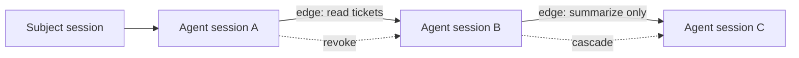

Delegation lets one agent session pass a narrower, typed slice of authority to another agent session.

It is represented as a graph of directed edges. Each edge connects a source session to a target session, carries scopes and constraints, and can be revoked independently.

## Graph Model

## Delegation Edge Fields

| Field | Purpose |
| --- | --- |
| Source session | The session that delegates authority. |
| Target session | The child or receiving agent session. |
| Issuer application | Application creating the delegation. |
| Receiver application | Application receiving authority. |
| Resource | Optional resource boundary for the edge. |
| Scopes | Subset of authority being delegated. |
| Constraints | Typed limits such as TTL, hop count, budget, and approval state. |
| Status | Active or revoked lifecycle state. |

## Rules

- Delegation should narrow authority, not expand it.
- Delegation paths must not cycle.
- Hop count should be bounded.
- Revoking an upstream edge should invalidate downstream authority.
- Resource servers should verify delegation claims when they require delegated access.

## SDK Relationship

The SDKs expose the same pattern in each language:

| Language | Spawn | Delegate | Delegate while spawning |
| --- | --- | --- | --- |
| TypeScript | `spawn()` | `delegate()` | `delegateToSpawn()` |
| Python | `spawn()` | `delegate()` | `delegate_to_spawn()` |
| Go | `Spawn()` | `Delegate()` | `DelegateToSpawn()` |

These helpers propagate session and delegation context so later token exchanges include the correct graph proof.

## Next Step

Read [Delegation Constraints](/concepts/constraint/) to understand the limits carried by each edge.

## Related Pages

- [Implement Multi-Agent Delegation](/guides/delegation/)
- [Audit and Request Traces](/concepts/audit-ledger/)
