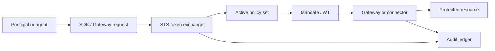

Caracal gives agents short-lived, policy-approved authority instead of long-lived secrets. Read this section after your first integration when you need the vocabulary behind guides, SDKs, operations pages, and API reference material.

## Read This Section in Order

| Start here | Use it to understand |
| --- | --- |
| [Caracal Mental Model](/concepts/model-overview/) | The smallest useful picture of Caracal. |
| [Authority and Enforcement](/concepts/authority-model/) | Where decisions happen before requests reach a target. |
| [Zones](/concepts/zone/) | The tenant boundary that owns keys, policies, resources, sessions, and audit. |
| [Identities and Applications](/concepts/principal/) | The identities that authenticate, run, and delegate. |
| [Resources and Grants](/concepts/resource-grant/) | What can be accessed and which scopes are granted. |
| [Policies and Policy Sets](/concepts/policy/) | Rego rules evaluated by the STS during token exchange. |
| [Step-Up Challenges](/concepts/step-up/) | How sensitive actions require fresh approval. |
| [Mandates](/concepts/mandate/) | The short-lived JWT that carries approved authority. |
| [Agent Delegation](/concepts/delegation/) | How one agent passes bounded authority to another. |
| [Delegation Constraints](/concepts/constraint/) | The limits attached to delegated authority. |
| [Sessions and Revocation](/concepts/sessions-revocation/) | How active authority is ended and propagated. |
| [Audit and Request Traces](/concepts/audit-ledger/) | The event trail behind decisions and runs. |

## Core Flow

The same model appears across the product:

- Onboarding uses the Console guided setup to create the first zone, application, resource, policy, and runtime profile.
- Guides use the SDKs, Console, Admin API, and connectors to build repeatable integrations.
- Operations pages use the same terms when explaining keys, revocation, audit, and runtime health.

## Term Map

| Term | Short definition | Canonical page |
| --- | --- | --- |
| Zone | Tenant boundary for authority data and signing keys. | [Zones](/concepts/zone/) |
| Application | Registered client or agent workload. | [Identities and Applications](/concepts/principal/) |
| Principal | User, service, or agent identity bound to a session. | [Identities and Applications](/concepts/principal/) |
| Resource | Protected API, MCP server, tool group, or upstream target. | [Resources and Grants](/concepts/resource-grant/) |
| Grant | Binding from an application and user to resource scopes. | [Resources and Grants](/concepts/resource-grant/) |
| Policy | Versioned Rego logic evaluated at token exchange. | [Policies and Policy Sets](/concepts/policy/) |
| Policy set | Versioned bundle of policies activated for a zone. | [Policies and Policy Sets](/concepts/policy/) |
| Mandate | Short-lived JWT issued by the STS after policy approval. | [Mandates](/concepts/mandate/) |
| Delegation edge | Bounded authority transfer between agent sessions. | [Agent Delegation](/concepts/delegation/) |
| Revocation anchor | Session, root session, agent session, or delegation edge checked by resource servers. | [Sessions and Revocation](/concepts/sessions-revocation/) |

## What to Read Next

After the concepts, use [Guides](/guides/) for task-focused procedures or [SDKs](/sdks/) for language-specific reference.
