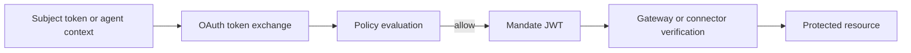

A mandate is the token Caracal issues after the STS approves an exchange. It is a short-lived JWT signed with the zone signing key and verified by the Gateway or resource connectors.

## What a mandate proves

A valid mandate proves:

- which zone issued it;
- which application and principal are acting;
- which session anchors are active;
- which resource targets and scopes were approved;
- whether authority came from an agent session or delegation edge;
- when the authority expires.

## Issuance path

## Mandate use

| Use | Verification focus |
| --- | --- |
| Gateway request | Issuer, audience, zone, resource, scopes, expiry, revocation. |
| MCP tool call | Bearer token, required scopes, required targets, agent/delegation constraints. |
| SDK outbound call | Context propagation and mandate header injection. |
| Delegated exchange | Agent session, delegation edge, scopes, hop count, and constraints. |

## Mandates are not API keys

Mandates are intentionally short lived and context bound. They should not be stored as durable credentials, copied into configuration files, or reused across unrelated resources.

Resource servers should always verify a mandate at request time. Verification includes signature and claim checks plus revocation-anchor checks for the session, root session, agent session, and delegation edge when present.

## Failure modes

| Failure | Meaning |
| --- | --- |
| `invalid_token` | Signature, issuer, audience, required claim, or expiry validation failed. |
| `scope_insufficient` | The mandate does not contain a required scope. |
| `session_revoked` | One of the mandate revocation anchors has been revoked. |
| `agent_identity_required` | The resource requires an agent mandate. |
| `delegation_required` | The resource requires delegated authority. |
| `chain_mismatch` | The delegation chain does not include the required application. |
| `hop_count_exceeded` | The delegation path exceeds the configured hop limit. |

## Related pages

- [Sessions and Revocation](/concepts/sessions-revocation/)
- [Protect an MCP Server](/guides/protect-mcp/)
- [Run an Agent with caracal run](/guides/runtime-run/)
