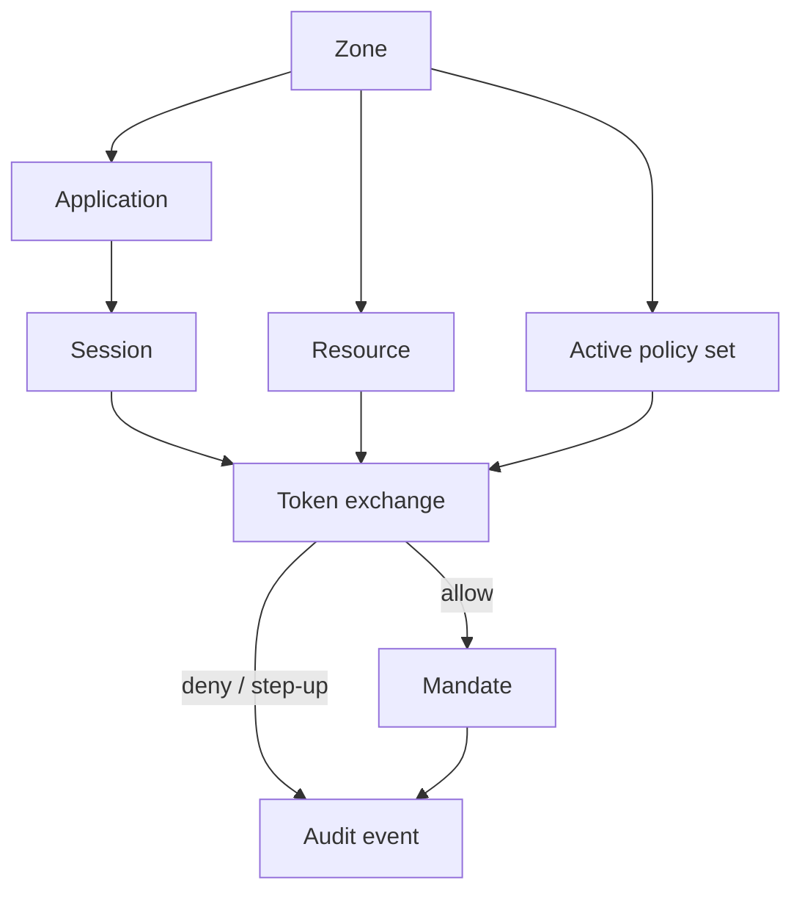

Caracal answers one question: **should this principal or agent receive scoped authority for this resource right now?**

It answers that question during token exchange, records the decision, and returns a mandate only when the active policy set allows the request.

## Six Core Nouns

| Noun | What it means |
| --- | --- |
| Zone | The tenant boundary for configuration, signing keys, policy, sessions, and audit. |
| Application | A registered client, service, or agent workload. |
| Principal | The acting identity, such as a user, service, or agent. |
| Resource | The protected target: API, MCP server, tool group, or upstream service. |
| Policy | Rego logic that evaluates the requested exchange. |
| Mandate | The short-lived JWT that proves authority to a Gateway or connector. |

Most of these are configured directly. A *grant* is a permission binding for resource scopes that policy can read during evaluation; it is not the mandate a resource server verifies.

## Three Runtime Verbs

| Verb | Meaning |
| --- | --- |
| Exchange | Ask the STS to convert existing identity into a resource mandate. |
| Spawn | Open an agent session derived from a subject session. |
| Delegate | Pass constrained authority from one agent session to another. |

## One Decision Point

The STS is the decision point. It evaluates the active policy set with the principal, session, resource, scopes, grant, delegation edge, and step-up context. If policy allows the request, the STS signs a mandate. If policy denies the request, no mandate is issued.

Resource servers still verify mandates locally through the Gateway or connectors. That keeps every request protected even after token exchange succeeds.

## Why This Model Matters

- Long-lived provider secrets stay out of agents.
- Authority expires quickly and can be revoked.
- Delegation carries typed constraints instead of informal trust.
- Every allow, deny, step-up, and revocation path is auditable.

Next, read [Authority and Enforcement](/concepts/authority-model/) to see where each enforcement layer fits.
