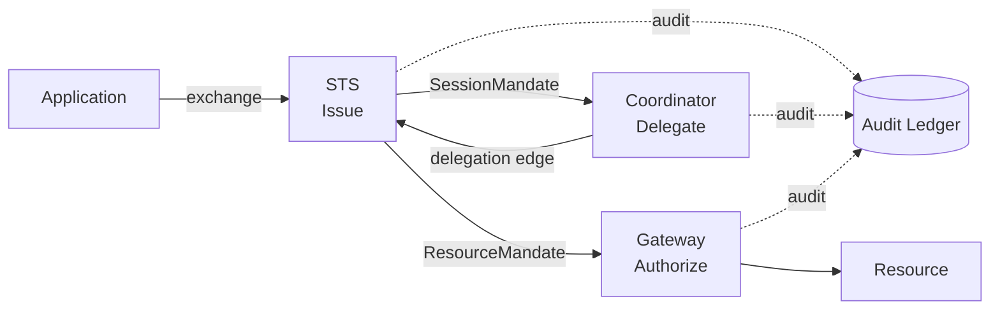

Read this page once and you can describe Caracal end-to-end. The deeper concept pages exist to defend the details; this page is the shape.

## Seven nouns

| Noun | What it is |
| --- | --- |
| **Zone** | Tenancy boundary. Owns its own keys, policies, and resources. |
| **Application** | A registered workload (agent, service, tool). The actor named in policy. |
| **Resource** | A protected target with a stable identifier and a fixed scope vocabulary. |
| **Grant** | A binding `(application, user, resource) → scopes` that makes an exchange eligible for policy evaluation. |
| **Policy** | Rego that returns `allow` or `deny` for one (application, resource, scopes) request. |
| **Mandate** | The short-lived signed credential the STS issues when policy allows. Two kinds: session and resource. |
| **AgentSession** | The runtime identity that ties one agent run to its mandates, delegations, and audit events. |

That is the whole vocabulary an operator needs. Every other word in the docs is a precise label for a sub-part of one of these.

## Three verbs

| Verb | Who runs it | What it does |
| --- | --- | --- |
| **Issue** | STS | Evaluates policy for one resource and either issues a mandate or records a deny. |
| **Delegate** | Coordinator | Adds an edge `(parent AgentSession → child AgentSession)` with narrower scopes and typed constraints. |
| **Authorize** | Gateway | Verifies an inbound mandate at the resource boundary (signature, replay, target, revocation). |

Authority only ever flows through these three verbs. If a request is denied, exactly one of them said no, and the reason is in the audit ledger.

## The one decision point

Pre-execution: the STS is the only place a mandate is born, and it is born only after a policy says `allow`. After-execution: the Gateway only enforces what the STS already decided. Delegation: the Coordinator narrows authority; the STS still issues the narrowed mandate.

## Reading the model back in one breath

> Inside a **Zone**, an **Application** asks the **STS** to **Issue** a **Mandate** for a **Resource**. The STS evaluates a **Policy** against the request, requires a matching **Grant**, and either issues the mandate or records a deny. If the Application delegates to a sub-agent, the **Coordinator** narrows the authority into a new **AgentSession**. When a mandate is presented at a Resource, the **Gateway** **Authorizes** it. Every decision is written to the **Audit Ledger**.

If a teammate cannot finish that paragraph after reading this page, the page has failed and should be shortened, not lengthened.

## Where to go next

- [Authority Model](./authority-model/) for the decision contract the STS enforces.
- [Mandate](./mandate/) for the JWT shape and lifecycle.
- [Delegation Graph](./delegation/) for how the Coordinator builds the edge graph.
- [Audit Ledger](./audit-ledger/) for the evidence trail.
