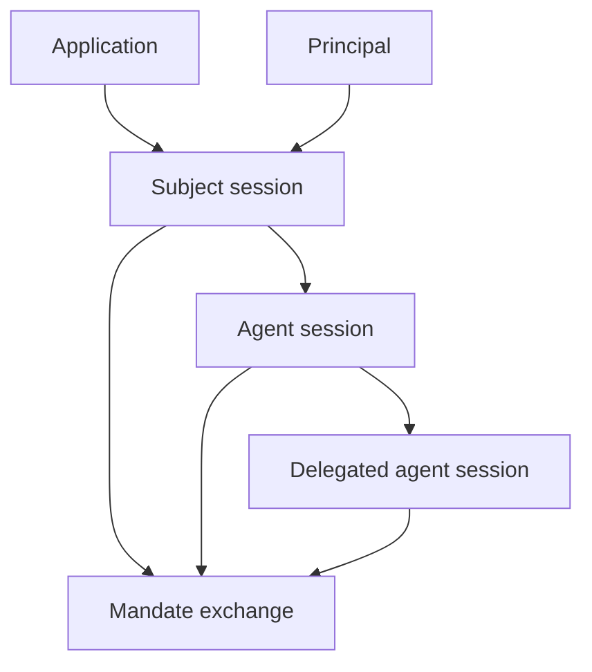

A principal is the acting identity. An application is the registered client or workload that authenticates and requests authority for that principal.

## Principal types

| Principal | Typical source | How Caracal sees it |
| --- | --- | --- |
| User | Login, workforce identity, or upstream IdP. | Subject session with user-bound claims. |
| Service | Workload credential or client secret. | Application-bound session or exchange subject. |
| Agent | Spawned runtime session. | Agent session with parent and delegation context. |

Principals are not enough on their own. A request also needs an application, session, resource, scopes, and policy approval.

## Application roles

Applications represent software that can participate in Caracal flows:

- an agent runtime that spawns child agents;
- a backend service that requests mandates;
- a Gateway application that fronts protected upstreams;
- a connector-protected resource server;
- a managed or dynamically registered client.

Applications have registration metadata, a server-owned token credential, and a registration method. Managed applications are operator-provisioned for known durable software. Dynamically registered applications are short-lived identities created through the zone DCR endpoint for spawned or high-churn agents.

## Managed and DCR applications

| Method | Identity boundary | Operational rule |
| --- | --- | --- |
| Managed | One durable service, orchestrator, Gateway, or known agent runtime. | Operators create it intentionally and may reuse it across many sessions for the same workload. |
| DCR | One spawned ephemeral agent identity. | DCR applications always expire, can bind to only one active ephemeral agent session, and should not be shared across spawned agents. |

DCR is for identity isolation, not bulk credential pooling. A runtime that spawns several ephemeral agents should register a separate DCR application for each spawned agent, then create exactly one ephemeral agent session for that application. The agent session carries the parent relationship, subject session, capabilities, and delegation context; the DCR application carries the short-lived credential identity used to authenticate token exchanges.

Disabling DCR on a zone has two separate operational meanings. The zone flag always stops future dynamic registration immediately. If live DCR applications already exist, operators must choose whether those identities continue until expiry or are revoked immediately. Revocation archives the live DCR applications, revokes related authority sessions and delegation anchors, and terminates related ephemeral agent access so STS, Gateway, and Coordinator paths stop accepting those identities.

Policies receive `input.principal.registration_method`, `input.principal.agent_session_id`, `input.principal.agent_kind`, and `input.principal.capabilities`, so policy authors can distinguish durable managed clients from ephemeral DCR clients without relying on SDK-specific behavior. Audit metadata records the application id, application name, registration method, agent session id, parent/delegation context, requested scopes, and resource for each token-exchange decision.

## Sessions bind identity to time

Sessions make authority revocable. A mandate contains session anchors, and resource servers check those anchors through the revocation layer.

## Naming guidance

- Use **application** for registered software.
- Use **principal** for the acting identity.
- Use **agent session** for a spawned agent execution context.
- Use **subject session** for the original authenticated subject context.
- Avoid using "client" unless you are describing OAuth protocol fields.

## Related pages

- [Sessions and Revocation](/concepts/sessions-revocation/)
- [Delegation Graph](/concepts/delegation/)
- [Integrate the TypeScript SDK](/guides/sdk-typescript/)
