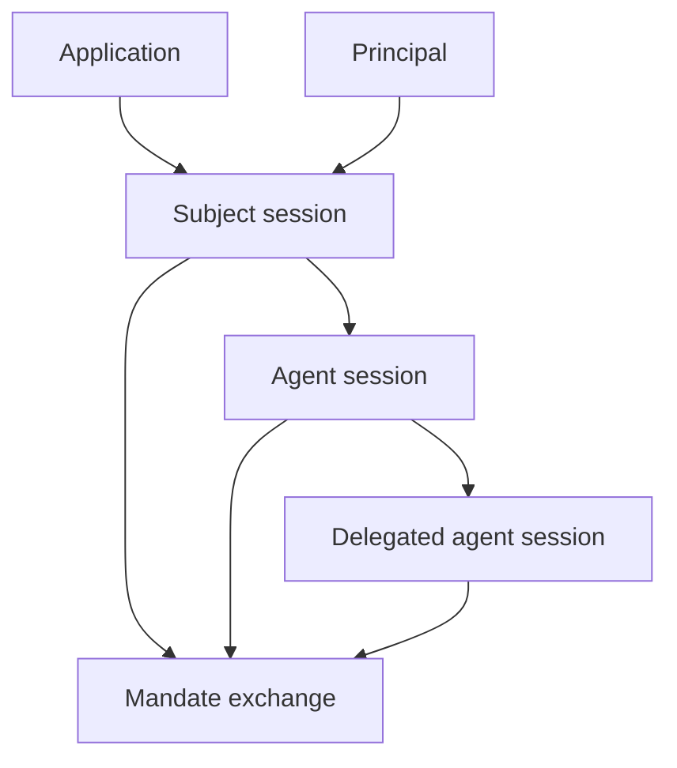

A principal is the acting identity. An application is the registered client or workload that authenticates and requests authority for that principal.

## Principal types

| Principal | Typical source | How Caracal sees it |
| --- | --- | --- |
| User | Login, workforce identity, or upstream IdP. | Subject session with user-bound claims. |
| Service | Workload credential or client secret. | Application-bound session or exchange subject. |
| Agent | Spawned runtime session. | Agent session with parent and delegation context. |

Principals are not enough on their own. A request also needs an application, session, resource, scopes, and policy approval.

## Application roles

Applications represent software that can participate in Caracal flows:

- an agent runtime that spawns child agents;
- a backend service that requests mandates;
- a Gateway application that fronts protected upstreams;
- a connector-protected resource server;
- a managed or dynamically registered client.

Applications have registration metadata, credential type, traits, and consent behavior. They are created from the Console or Admin API.

## Sessions bind identity to time

Sessions make authority revocable. A mandate contains session anchors, and resource servers check those anchors through the revocation layer.

## Naming guidance

- Use **application** for registered software.
- Use **principal** for the acting identity.
- Use **agent session** for a spawned agent execution context.
- Use **subject session** for the original authenticated subject context.
- Avoid using "client" unless you are describing OAuth protocol fields.

## Related pages

- [Sessions and Revocation](/concepts/sessions-revocation/)
- [Delegation Graph](/concepts/delegation/)
- [Integrate the TypeScript SDK](/guides/sdk-typescript/)
