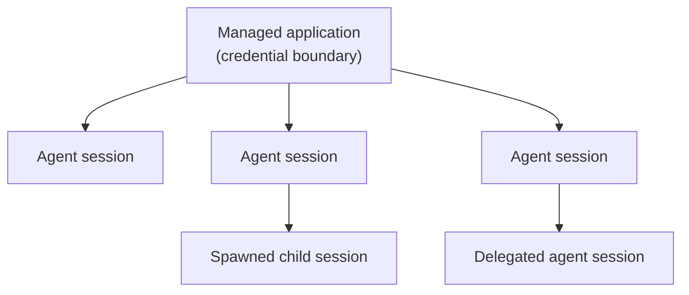
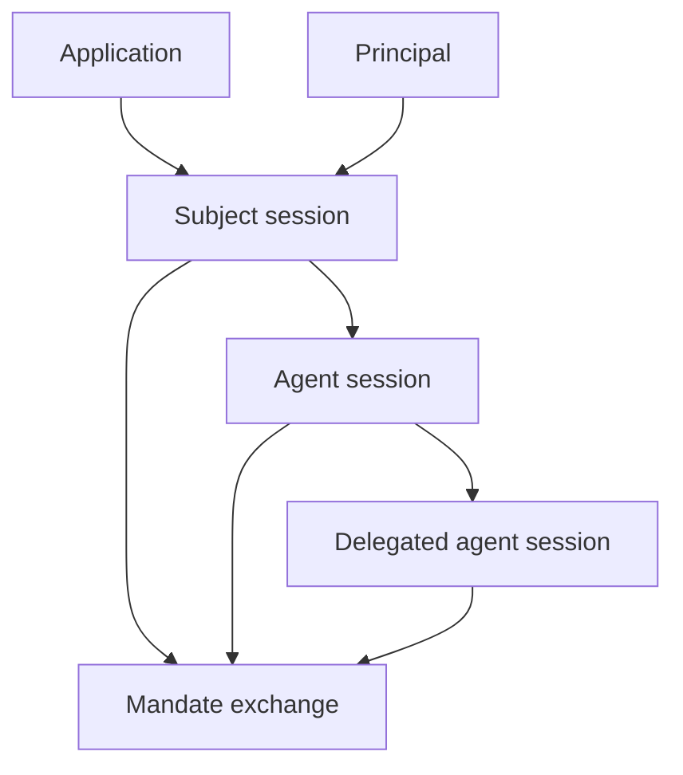

A principal is the acting identity. An application is the registered client or workload that authenticates and requests authority for that principal.

## Principal Types

| Principal | Typical source | How Caracal sees it |
| --- | --- | --- |
| User | Login, workforce identity, or upstream IdP. | Subject session with user-bound claims. |
| Service | Workload credential or client secret. | Application-bound session or exchange subject. |
| Agent | Spawned runtime session. | Agent session with parent and delegation context. |

Principals are not enough on their own. A request also needs an application, session, resource, scopes, and policy approval.

## Application Roles

Applications represent software that can participate in Caracal flows:

- an agent runtime that spawns child agents;
- a backend service that requests mandates;
- a Gateway application that fronts protected upstreams;
- a connector-protected resource server;
- a managed or dynamically registered client.

Applications have registration metadata, a server-owned token credential, and a registration method. Managed applications are operator-provisioned for known durable software, including the runtime that spawns and fans out child agents. Dynamically registered applications are short-lived, isolated identities created through the zone DCR endpoint when a separate auto-expiring credential boundary is needed — for example a per-tenant or per-integration identity — rather than for ordinary spawn fan-out.

## Applications Are the Credential Boundary; Agents Are the Runtime Unit

An application is registered, holds a server-owned secret, and is the identity Caracal authenticates. An agent session is created at runtime by the workload that already holds that secret; it costs nothing to create and carries the parent, subject, labels, and delegation context. One application backs many agent sessions, so a durable workload uses **one managed application** and spawns, delegates, and fans out as many agent sessions as it needs. You do not register an application per agent — see [Should I create one application per agent?](/reference/faq/#faq-006).

## Managed and DCR Applications

| Method | Identity boundary | Operational rule |
| --- | --- | --- |
| Managed | One durable service, orchestrator, Gateway, or agent runtime — including the runtime that spawns and fans out child agents. | Operators create it intentionally and reuse it across many agent sessions for the same workload. Spawned children run as `agent` sessions under this same application. |
| DCR | One short-lived, isolated application identity (per tenant, per integration, or per externally-issued ephemeral identity). | Registered through the zone DCR endpoint (a control-plane action), always expires, binds to exactly one agent session, and is not a spawn parent for further sessions. |

The coordinator records each agent session's `lifecycle`, which is either `task` (the default for every `spawn()`) or `service` (a durable, heartbeat-leased handle created by [`service()`](/reference/sdk-python/#service)). The value names the runtime lifecycle, not the actor — every runtime actor is an agent session; `lifecycle` only says whether it runs task-scoped or as a heartbeat-leased service. The credential boundary between durable managed identities and short-lived DCR identities is named by `registration_method` (managed vs DCR), not by lifecycle — a DCR application cannot host a `service` session, so its single session is always a `task` session.

`lifecycle` carries one behavioral distinction: a `service` session holds a heartbeat lease and is swept when that lease lapses, while a `task` session is task-scoped — it is retired when its work completes (optionally bounded by a TTL). It does not change what an agent may do or which authority it carries.

A **short-lived worker is not a separate lifecycle** — it is an ordinary `task` session created with a TTL. The mainstream tree of a long-lived orchestrator, mid-tier managers, and disposable task workers is modelled under **one managed application**:

- the orchestrator is the durable root session (or a [`service()`](/reference/sdk-python/#service) handle when it needs a heartbeat lease),
- each manager is a plain `spawn()` that inherits the application's authority,
- each task worker is `spawn(grant=Grant.narrow([...]), ttl_seconds=…)` — least-privilege and auto-terminated on block exit, with the TTL sweeper as a backstop.

Every node in that tree is a `task` session under the one managed app, distinguished by its `agent_session_id`, `labels`, and delegation context. "Disposable worker" is expressed by the TTL and the narrowed grant, not by a separate lifecycle.

DCR is therefore for credential isolation, not for spawn fan-out: it gives a unit of work its own independently revocable, auto-expiring **application** identity, not a shorter-lived agent.

A DCR application is reached by **authenticating as it**, not by spawning. The control plane registers the DCR application through the zone DCR endpoint (an Admin API action that returns a one-time secret and a short expiry); the SDK never registers applications. An orchestrator injects those credentials into an independently launched workload, and that workload — configured with the DCR `application_id` and secret — authenticates with the `client_credentials` grant and creates its single root session. The application then expires and is archived. Use this when a unit of work needs its own isolated, independently revocable, auto-expiring identity, such as a per-tenant or per-integration runtime.

:::note[FAQ]
[What is the difference between an application, principal, and agent session?](/reference/faq/#faq-005) and [when should I use a managed application versus DCR?](/reference/faq/#faq-007)
:::

Disabling DCR on a zone has two separate operational meanings. The zone flag always stops future dynamic registration immediately. If live DCR applications already exist, operators must choose whether those identities continue until expiry or are revoked immediately. Revocation archives the live DCR applications, revokes related authority sessions and delegation anchors, and terminates related DCR agent access so STS, Gateway, and Coordinator paths stop accepting those identities.

Policies receive `input.principal.registration_method`, `input.principal.agent_session_id`, `input.principal.lifecycle`, and `input.principal.labels`, so policy authors can distinguish durable managed clients from short-lived DCR clients through `registration_method` without relying on SDK-specific behavior. Audit metadata records the application id, application name, registration method, agent session id, parent/delegation context, requested scopes, and resource for each token-exchange decision.

## Telling Agent Sessions Apart

Every agent session has one canonical identity: the server-minted `agent_session_id`. It is unique, returned to the caller the moment `spawn()` (or `service()`) creates the session, and stamped onto every token exchange and audit event that session produces. That id — not the application, lifecycle, or labels — is the answer to "which agent did this?".

`labels` are a descriptor, not an identity. Many sessions under one application can share the same labels on purpose: that is how fan-out works, where a hundred `["pricing-worker"]` sessions are intentionally interchangeable. When sessions must be told apart by meaning rather than by raw id, give them distinguishing `labels`, attach business correlation in `metadata`, or propagate a `trace_id`. Two sessions that share the same application, labels, and metadata are fungible by design — the unique `agent_session_id` still separates them in audit.

The zone audit endpoint filters directly on these fields: query `agent_session_id` to follow one exact session, or `label` to scope to a role across a fleet of sessions.

## Sessions Bind Identity to Time

Sessions make authority revocable. A mandate contains session anchors, and resource servers check those anchors through the revocation layer.

## Naming Guidance

- Use **application** for registered software.
- Use **principal** for the acting identity.
- Use **agent session** for a spawned agent execution context.
- Use **subject session** for the original authenticated subject context.
- Avoid using "client" unless you are describing OAuth protocol fields.

## Next Step

Read [Resources and Grants](/concepts/resource-grant/) to understand what identities can request.

## Related Pages

- [Sessions and Revocation](/concepts/sessions-revocation/)
- [Agent Delegation](/concepts/delegation/)
- [Integrate the TypeScript SDK](/guides/sdk-typescript/)
