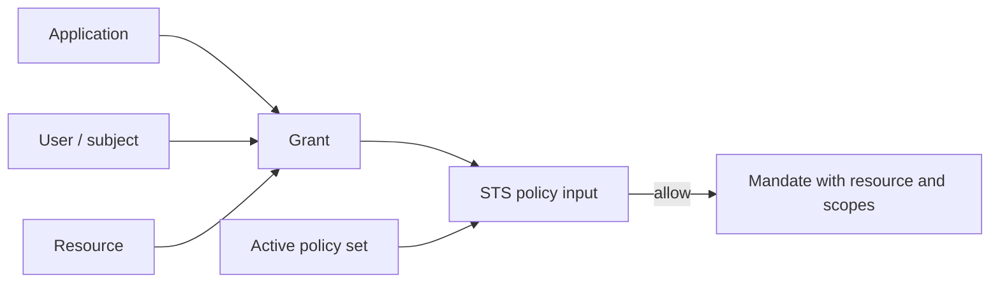

A resource is something Caracal protects. A grant is a configured permission binding that says an application and user may request specific scopes for that resource.

## Resources

Resources describe protected targets such as:

- HTTP APIs behind the Gateway;
- MCP servers and tool groups;
- internal services protected by Express, FastMCP, or net/http connectors;
- provider-backed targets that need credential mediation.

| Resource field | Purpose |
| --- | --- |
| Identifier | Stable policy and token audience target. Always use the `resource://<slug>` convention, such as `resource://pipernet`; keep it stable even when the upstream URL changes. |
| Upstream URL | Gateway forwarding target. |
| Scopes | Named Caracal resource actions that policies and mandates can constrain. |
| Gateway application | Application identity used by Gateway-mediated resources. |
| Upstream credential provider | Resource binding to the provider record used when Gateway attaches no credential, a Caracal mandate, OAuth tokens, API keys, or bearer tokens. |

:::note[FAQ]
[What is the difference between a resource and a provider?](/reference/faq/#faq-resource-versus-provider) and [why must the resource identifier stay stable?](/reference/faq/#faq-stable-resource-identifier)
:::

## Grants

A grant binds:

1. a zone;
2. an application;
3. a user or subject;
4. a resource;
5. one or more scopes.

Grants are not the final decision. They are one input to policy. The active policy set can still deny, require step-up, or constrain the exchange.

## Exchange Relationship

## Scope Design

Prefer small, action-oriented scopes:

| Good | Avoid |
| --- | --- |
| `payments:read` | `admin` |
| `tickets:comment` | `write_all` |
| `mcp:tool:call` | `tools` |

Use resource identifiers for targets and scopes for actions. Do not encode environment, tenant, or user identity into scope names when those belong in the zone, principal, or policy input.

:::note[FAQ]
[How should I design scopes?](/reference/faq/#faq-scope-design) and [do I manage grants directly?](/reference/faq/#faq-do-i-manage-grants-directly)
:::

## Next Step

Read [Policies and Policy Sets](/concepts/policy/) to understand how grants become allow, deny, or step-up decisions.

## Related Pages

- [Define Resources and Providers](/guides/resources-providers/)
- [Model Your Application in Caracal](/guides/modeling-recipes/)
- [Debug Authorization Decisions](/guides/authorize-access/)
