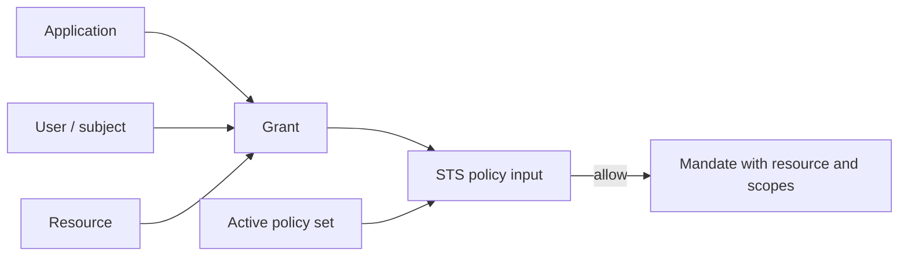

A resource is something Caracal protects. A grant is a configured permission binding that says an application and user may request specific scopes for that resource.

## Resources

Resources describe protected targets such as:

- HTTP APIs behind the Gateway;
- MCP servers and tool groups;
- internal services protected by Express, FastMCP, or net/http connectors;
- provider-backed targets that need credential mediation.

| Resource field | Purpose |
| --- | --- |
| Identifier | Stable policy and token audience target, such as `https://api.example.com/payments`. |
| Upstream URL | Optional Gateway forwarding target. |
| Scopes | Named actions that policies and mandates can constrain. |
| Gateway application | Optional application used by Gateway-mediated resources. |
| Credential provider | Optional provider used when Caracal brokers upstream credentials. |

## Grants

A grant binds:

1. a zone;
2. an application;
3. a user or subject;
4. a resource;
5. one or more scopes.

Grants are not the final decision. They are one input to policy. The active policy set can still deny, require step-up, or constrain the exchange.

## Exchange relationship

## Scope design

Prefer small, action-oriented scopes:

| Good | Avoid |
| --- | --- |
| `payments:read` | `admin` |
| `tickets:comment` | `write_all` |
| `mcp:tool:call` | `tools` |

Use resource identifiers for targets and scopes for actions. Do not encode environment, tenant, or user identity into scope names when those belong in the zone, principal, or policy input.

## Related pages

- [Define Resources and Providers](/guides/resources-providers/)
- [Issue Grants and Invitations](/guides/grants-invitations/)
- [Policy](/concepts/policy/)
