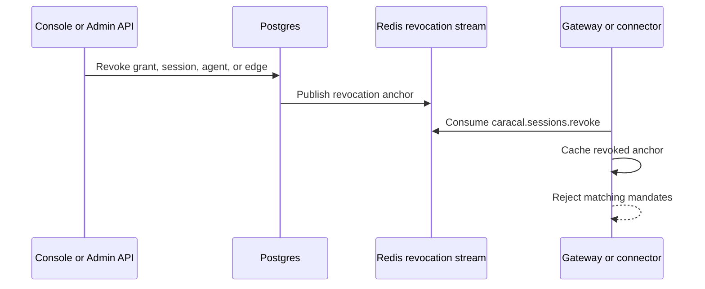

Sessions make Caracal authority temporary and revocable. A mandate includes session anchors, and resource servers check those anchors before accepting the mandate.

## Session types

| Session | Role |
| --- | --- |
| Subject session | Original authenticated user or service context. |
| Agent session | Runtime context for a spawned agent. |
| Delegated session | Agent session receiving constrained authority through a delegation edge. |

## Revocation anchors

Resource servers check every relevant anchor:

- session ID;
- root session ID;
- agent session ID;
- delegation edge ID.

If any anchor is revoked, the mandate should be rejected as `session_revoked`.

## Revocation flow

The Redis stream name is `caracal.sessions.revoke`. Redis-backed connector packages can consume the stream and populate local revocation stores.

## Cascade behavior

Revocation should follow authority:

- revoking a subject session invalidates derived agent sessions;
- revoking an agent session invalidates its child edges;
- revoking a delegation edge invalidates downstream delegated authority;
- revoking a grant prevents future exchange and can invalidate active sessions depending on workflow.

## Resource-server responsibility

The Gateway and connectors must be configured with a revocation store. For development, an in-memory store can be useful. For production, use a shared store and stream consumer so revocations propagate across resource-server instances.

## Related pages

- [Mandate](/concepts/mandate/)
- [Protect an MCP Server](/guides/protect-mcp/)
- [Tail and Query the Audit Stream](/guides/audit-stream/)
