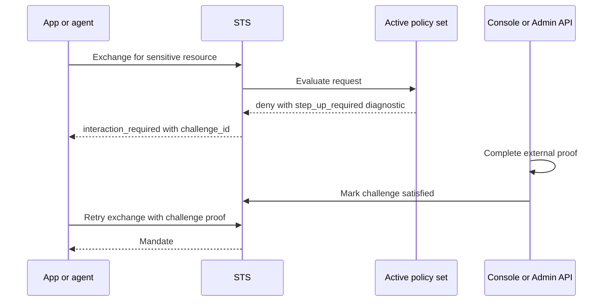

Step-up is Caracal's way to pause a token exchange and require fresh proof before issuing a mandate for a sensitive resource.

Policy triggers step-up by returning a diagnostic such as `{"step_up_required": "mfa"}`. The STS converts that diagnostic into an `interaction_required` error with a challenge ID.

## Step-Up Flow

## Components

| Component | Responsibility |
| --- | --- |
| Policy | Decides when step-up is required. |
| STS | Creates the challenge, throttles failed attempts, and verifies challenge proof during retry. |
| Console or Admin API | Lists, inspects, and satisfies challenges after an external proof step. |
| SDK or OAuth client | Surfaces `interaction_required` so the application can guide the user or operator. |

## Challenge Lifecycle

| State | Meaning |
| --- | --- |
| Created | STS issued a challenge for a specific zone, session, resource set, and challenge type. |
| Satisfied | A different approver or external proof completed the requirement. |
| Consumed | STS accepted the proof during retry and issued the mandate. |
| Expired or invalid | The challenge can no longer be used. |

## Design Guidance

- Use step-up for high-risk resources, sensitive scopes, or unusual context.
- Keep the proof step outside policy; policy should decide that proof is needed, not perform the proof.
- Prevent self-approval for sensitive challenges.
- Include enough diagnostics for the Console and audit views to explain the requirement.
- Retry token exchange only after the challenge is satisfied.

## Next Step

Read [Mandates](/concepts/mandate/) to understand what the STS issues after an exchange is allowed or satisfied.

## Related Pages

- [Step-Up Re-Authentication](/guides/step-up/)
- [Policies and Policy Sets](/concepts/policy/)
- [Audit and Request Traces](/concepts/audit-ledger/)
