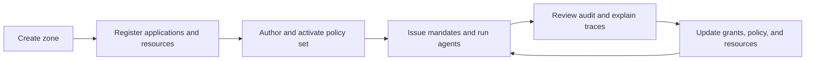

A zone is the main isolation boundary in Caracal. It groups the configuration and runtime state needed to decide, issue, verify, revoke, and audit authority.

## What a Zone Owns

| Area | Zone-owned data |
| --- | --- |
| Identity | Applications, credentials, subject sessions, and agent sessions. |
| Authorization | Resources, providers, grants, policies, policy sets, and step-up challenges. |
| Cryptography | Zone signing keys and JWKS used to verify mandates. |
| Delegation | Delegation edges, constraints, depth limits, and cascade revocation state. |
| Audit | Decision events, diagnostics, request IDs, and explain traces. |

## Why Zones Exist

Zones let teams run separate environments, tenants, or trust domains without mixing authority data.

Common zone boundaries include:

- production, staging, and development environments;
- separate customers in a hosted deployment;
- isolated product areas with different policy owners;
- high-sensitivity resources that need distinct keys and audit trails.

When several boundaries could apply at once, use [Model Your Application in Caracal](/guides/modeling-recipes/) to choose between a separate zone, a shared zone with separate resources, and a customer attribute in policy input. To serve many of your own customers from one zone, follow [Serve Your Own Customers](/guides/serve-customers/).

:::note[FAQ]
[What should a zone represent?](/reference/faq/#faq-003)
:::

## Zone Lifecycle

Zone setup is normally managed through the web console. The Admin API exposes the same objects for automation.

## Key and Policy Isolation

Each zone has its own signing-key and JWKS context. Resource servers verify mandates against the issuer, audience, and expected zone. Policy activation is also zone-scoped: activating a policy set in one zone does not affect another zone.

## Dynamic Client Registration

A zone gates whether workloads may self-register short-lived [DCR applications](/concepts/principal/#managed-and-dcr-applications). DCR is **off by default**; an operator turns it on per zone (`dcr_enabled`). While enabled, a control-plane workload holding an admin token can mint auto-expiring application identities through the zone DCR endpoint — Console never creates them.

Disabling DCR on a zone that still has live DCR applications requires an explicit decision, because turning the gate off does not by itself revoke identities already issued:

| Choice | Effect |
| --- | --- |
| Keep live | Blocks new registrations; existing DCR applications stay valid until their own expiry. |
| Revoke live | Blocks new registrations and immediately archives live DCR applications, revoking their sessions and terminating related agent access. |

The Console prompts for this choice when you disable DCR with live applications, and the Admin API takes the same decision through the `dcr_shutdown` field on a zone patch (`zones.patch(id, { dcr_enabled: false, dcr_shutdown: 'keep_live' | 'revoke_live' })`). Use `zones.dcrStatus(id)` to read the live DCR application count before deciding.

## Operational Guidance

- Keep production and non-production authority in separate zones.
- Name zones after the trust boundary, not a single service.
- Keep resource identifiers stable because policies, grants, and audit traces refer to them.
- Rotate zone signing keys using the operations workflow, then confirm resource servers load the current JWKS.

## Next Step

Read [Identities and Applications](/concepts/principal/) to understand who acts inside a zone.

## Related Pages

- [Resources and Grants](/concepts/resource-grant/)
- [Model Your Application in Caracal](/guides/modeling-recipes/)
- [Audit and Request Traces](/concepts/audit-ledger/)
