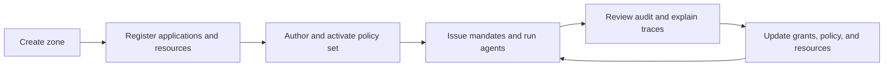

A zone is the main isolation boundary in Caracal. It groups the configuration and runtime state needed to decide, issue, verify, revoke, and audit authority.

## What a zone owns

| Area | Zone-owned data |
| --- | --- |
| Identity | Applications, credentials, subject sessions, and agent sessions. |
| Authorization | Resources, providers, grants, policies, policy sets, and step-up challenges. |
| Cryptography | Zone signing keys and JWKS used to verify mandates. |
| Delegation | Delegation edges, constraints, depth limits, and cascade revocation state. |
| Audit | Decision events, diagnostics, request IDs, and explain traces. |

## Why zones exist

Zones let teams run separate environments, tenants, or trust domains without mixing authority data.

Common zone boundaries include:

- production, staging, and development environments;
- separate customers in a hosted deployment;
- isolated product areas with different policy owners;
- high-sensitivity resources that need distinct keys and audit trails.

When several boundaries could apply at once, use [Model Your Application in Caracal](/guides/modeling-recipes/) to choose between a separate zone, a shared zone with separate resources, and a customer attribute in policy input.

:::note[FAQ]
[What should a zone represent?](/reference/faq/#faq-what-should-a-zone-represent)
:::

## Zone lifecycle

Zone setup is normally managed through the Console. The Admin API exposes the same objects for automation.

## Key and policy isolation

Each zone has its own signing-key and JWKS context. Resource servers verify mandates against the issuer, audience, and expected zone. Policy activation is also zone-scoped: activating a policy set in one zone does not affect another zone.

## Operational guidance

- Keep production and non-production authority in separate zones.
- Name zones after the trust boundary, not a single service.
- Keep resource identifiers stable because policies, grants, and audit traces refer to them.
- Rotate zone signing keys using the operations workflow, then confirm resource servers load the current JWKS.

## Related pages

- [Principal and Application](/concepts/principal/)
- [Resource and Grant](/concepts/resource-grant/)
- [Model Your Application in Caracal](/guides/modeling-recipes/)
- [Audit Ledger](/concepts/audit-ledger/)
