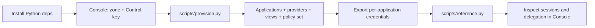

Lynx Capital is a runnable reference under `examples/lynxCapital`. It models a
finance-operations platform: an LLM swarm of orchestrators, regional workflows, and
thousands of ephemeral domain workers executes payout cycles across twenty partner
providers, with every agent and every provider call governed by Caracal. It is the primary
reference for modelling permission boundaries, spawned agents, providers, resources, and
policies on Caracal.

## Architecture

| Building block | Role |
| --- | --- |
| Applications | `lynx-operations`, `lynx-intake`, `lynx-ledger`, `lynx-compliance`, `lynx-treasury`, `lynx-payments`, `lynx-audit` — one **managed application** per permission boundary, each holding only its own partner authority. |
| Agents | Every spawned agent — orchestrator or worker — is its own **agent session** under its role's application, labeled `[role, lynx-swarm]` with run and agent metadata, narrowed by a delegation edge to its role's scopes and views. |
| Providers | Twenty partner **credential providers** (`provider://<slug>`), each registered in the exact config shape its kind supports: API key, bearer token, OAuth client credentials, OAuth authorization code, Caracal mandate, or none. |
| Resources | Per-application **resource views** (`resource://<app>-<provider>`). The Gateway binds each view to exactly one application, so shared partners expose one view per boundary, each carrying only that boundary's scopes. |
| Policy set | `lynx-finance-ops`: default-deny base, generated bindings and grants data, and one shared decisions policy allowing exactly each application's role-granted mandate mints and gateway calls. |

The model is declared once in `config/tenancy.yaml`; the SDK seam, agent runner,
provisioning, and policy all read from it.

### Why one application per permission boundary

A Caracal application is a credential and trust boundary, and the Gateway binds each
resource to exactly one application. Splitting the swarm by permission boundary means a
payments worker and an audit worker can both reach the same partner — through different
views, with different scopes — while a compromised intake agent can never present payment
authority. Agents are sessions, not applications: each spawn gets its own identity, labels,
delegation edge, and audit trail without minting new application credentials.

### Spawned agents

The swarm's runner gives every agent its own session via the SDK's `spawn`:
orchestrators inherit under the operations boundary; each domain worker spawns under its
application's per-run dispatcher root with `Grant.narrow(role scopes, views, max_hops=1,
run TTL)`. Ad-hoc partner-integration workers resolve their boundary, scope, and view
dynamically from the requested provider operation. Logs and policy decisions identify
exactly which agent did what.

### Customer attribution and confinement

Workers acting on one customer's records — invoicing, dunning, payment application — spawn
with a `customer:<id>` label and a `customer_id` metadata key. The metadata key makes
per-customer audit a direct filter over the shared zone trail; the label is policy input,
and the base policy confines customer-labeled agents to the customer-record scopes, so a
worker dunning one customer can never mint treasury or payment-rail authority. This is the
[Serve Your Own Customers](/guides/serve-customers/) pattern applied to app-only work: one
zone, customer separation carried by sessions, labels, metadata, and policy.

## Setup flow



## Commands

```bash
cd examples/lynxCapital
python -m venv .venv
source .venv/bin/activate
pip install -e ".[dev]"
cp -n .env.example .env
```

The workload `.env` carries the zone and one `LYNX_CARACAL_<APP>_APPLICATION_ID` /
`_CLIENT_SECRET` pair per boundary. Provisioning uses a separate operator file and a
scoped Control key created once in Console.

```bash
cp -n .env.provision.example .env.provision   # set CONTROL_CLIENT_ID / _SECRET
. .env.provision
python scripts/provision.py     # applications, providers, views, policy set (idempotent)
python scripts/reference.py     # SDK walkthrough: labeled spawns, narrowed grants, mandates
python scripts/teardown.py      # remove the provisioned objects
```

`provision.py` prints the per-application credential exports as it creates each
application; each client secret is returned exactly once. It also renders the
application-id bindings into the policy library before authoring it, so policy decisions
key on the real control-plane UUIDs.

## Policies

`policies/` is an importable, OPA-tested library. The base policy default-denies and owns
the decision contract; generated data documents carry the application bindings and the
resource-view grants; one shared decisions policy allows mandate mints (scope ∩
delegation edge, role label granted, view owned by the caller) and gateway uses (mandate
target includes the view), naming the deciding application boundary in every decision.
Expected access behavior is documented in
`policies/README.md`.

```bash
opa test policies/ -v
```

## SDK integration

Application code uses two seams: `app/caracal.py` (per-application runtimes, worker
authority, mandate minting, gateway calls) and `app/agents/runner.py` (per-agent session
lifecycle):

```python
handle = await runner.aspawn("payment-execution", "payments.us", parent=fc, layer="worker")
result = partners.call("meridian-pay", "create_payout", payload, authority=handle.authority)
```

Every partner call resolves the operation's scope from the model, verifies the calling
agent's grant client-side, mints (or reuses) a resource mandate for the agent's view, and
posts through the Gateway — which re-evaluates policy, injects the provider credential, and
forwards upstream. Agents never hold partner secrets.

## Tests

```bash
opa test policies/ -v
pytest tests/
```

The tests cover the policy decision suite, the identity-model and provisioning-plan
builders, the runner and authority seams, and the provider transports, topology, and
lifecycle of the bundled workload.

## Bundled demo workload

The repository ships the FastAPI and LangGraph swarm with a simulated payout cycle against
local provider fixtures under `_mock/`.

```bash
docker compose -f _mock/docker-compose.yml up -d --build --wait
python -m uvicorn app.main:app --reload --port 8000
docker compose -f _mock/docker-compose.yml down
```

Open `http://localhost:8000`; the guided `/setup` wizard teaches the one-zone,
per-boundary-application, provider, resource-view, and policy-library flow.

## Related examples

- [Run Echo Upstream](/examples/echo-upstream/)
- [Launch Research Agent](/examples/research-agent/)
