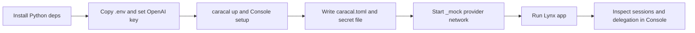

Lynx Capital is a runnable reference lab under `examples/lynxCapital`. It models an autonomous financial execution workflow that processes a global SaaS payout cycle with a live agent topology view and SSE log stream.

## What it uses

| Area | Current implementation |
| --- | --- |
| App framework | FastAPI on port `8000`. |
| Agent workflow | LangGraph/LangChain-based swarm. |
| Python runtime | Python `>=3.12`. |
| Caracal package | `caracalai-sdk==0.1.3rc1`. |
| Provider fixtures | Local REST, SSE, gRPC, and MCP fixtures under `_mock/`. |
| Caracal services | Released runtime/Console, API, Coordinator, Gateway, STS, Redis. |

## Setup flow



## Commands

```bash
cd examples/lynxCapital
python -m venv .venv
source .venv/bin/activate
pip install -e .
pip install -e _mock/sdk/lynx_sdk_stripe_treasury -e _mock/sdk/lynx_sdk_tax
cp .env.example .env
```

Start Caracal with the released runtime and Console, then use Console to create the Lynx zone, enable Control, create a control key, and register provider resources.

```bash
caracal up
caracal status --ready
caracal-console
```

Start local provider fixtures:

```bash
docker compose -f _mock/docker-compose.yml up -d --build --wait
```

Run the app:

```bash
python -m uvicorn app.main:app --reload --port 8000
```

Open `http://localhost:8000`.

## App routes

| Path | Purpose |
| --- | --- |
| `/` | Scenario landing page. |
| `/setup` | Validates OpenAI and Caracal connectivity. |
| `/demo` | Chat interface and live agent topology graph. |
| `/logs` | Runtime activity stream. |
| `/prompts` | Ready-to-run prompts. |

## Tests

```bash
pytest tests/
```

The tests cover provider transports, topology, lifecycle behavior, and Caracal boundary assumptions.

## Teardown

```bash
docker compose -f _mock/docker-compose.yml down
caracal down
```

Use `caracal purge` only when you intentionally want to remove local runtime state and generated profile material.

## Related examples

- [Run Echo Upstream](/examples/echo-upstream/)
- [Launch Research Agent](/examples/research-agent/)
