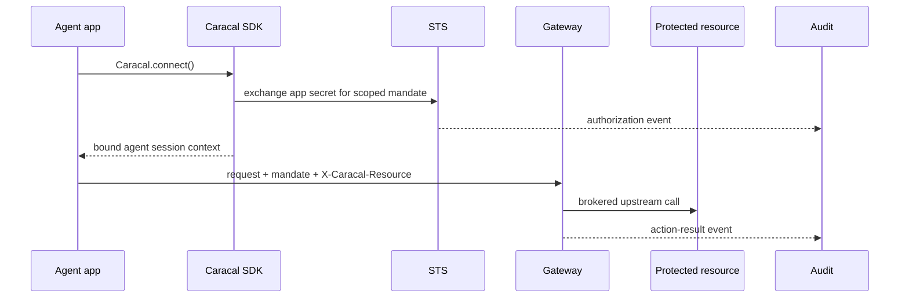

This page shows the smallest SDK integration in TypeScript, Python, and Go. Each example opens an agent session, calls a Gateway-protected resource, and leaves both authorization and action-result audit behind.

Complete [Five-Minute Setup](./five-minute-setup/) first so you have a generated runtime profile, a resource ID, and a real protected path.

## Integration shape



## Configuration

All SDKs can read the runtime profile generated by Console guided setup.

```bash
export CARACAL_CONFIG=/path/to/caracal.toml
export CARACAL_RESOURCE_ID=resource://example-api
export CARACAL_RESOURCE_PATH=/real/protected/path
```

The profile supplies zone, application, STS URL, Coordinator URL, app secret file, Gateway URL, and resource bindings. The two environment variables above choose which configured resource and path these examples call.

## TypeScript

```sh
npm install @caracalai/sdk
```

```typescript
import { AgentKind, Caracal } from "@caracalai/sdk";

const caracal = Caracal.connect();
const resourceId = process.env.CARACAL_RESOURCE_ID;
const resourcePath = process.env.CARACAL_RESOURCE_PATH;

if (!resourceId) throw new Error("CARACAL_RESOURCE_ID is required");
if (!resourcePath) throw new Error("CARACAL_RESOURCE_PATH is required");

await caracal.spawn(async () => {
  const ctx = caracal.current();
  console.log("Agent session:", ctx?.agentSessionId);

  const response = await caracal.fetch(resourceId, resourcePath, {
    method: "POST",
    headers: { "Content-Type": "application/json" },
    body: JSON.stringify({}),
  });

  console.log(await response.text());
}, { kind: AgentKind.Ephemeral });
```

## Python

```sh
pip install caracalai-sdk
```

```python
import asyncio
import os

from caracalai_sdk import AgentKind, Caracal

caracal = Caracal.connect()
resource_id = os.environ["CARACAL_RESOURCE_ID"]
resource_path = os.environ["CARACAL_RESOURCE_PATH"]

async def main():
    async with caracal.spawn(kind=AgentKind.EPHEMERAL) as ctx:
        print("Agent session:", ctx.agent_session_id)

        response = await caracal.fetch(
            resource_id,
            resource_path,
            method="POST",
            headers={"Content-Type": "application/json"},
            json={},
        )
        print(response.text)

asyncio.run(main())
```

## Go

```sh
go get github.com/garudex-labs/caracal/packages/sdk/go
```

```go
package main

import (
    "context"
    "fmt"
    "io"
    "net/http"
    "os"

    caracal "github.com/garudex-labs/caracal/packages/sdk/go"
)

func main() {
    c, err := caracal.Connect()
    if err != nil {
        panic(err)
    }

    resourceID := os.Getenv("CARACAL_RESOURCE_ID")
    resourcePath := os.Getenv("CARACAL_RESOURCE_PATH")
    if resourceID == "" || resourcePath == "" {
        panic("CARACAL_RESOURCE_ID and CARACAL_RESOURCE_PATH are required")
    }

    err = c.Spawn(context.Background(), func(ctx context.Context) error {
        cc, _ := c.Current(ctx)
        fmt.Println("Agent session:", cc.AgentSessionID)

        header := http.Header{}
        header.Set("Content-Type", "application/json")
        resp, err := c.Fetch(ctx, http.MethodPost, resourceID, resourcePath, nil, header)
        if err != nil {
            return err
        }
        defer resp.Body.Close()

        body, _ := io.ReadAll(resp.Body)
        fmt.Println(string(body))
        return nil
    })
    if err != nil {
        panic(err)
    }
}
```

## What the SDK primitives do

| Primitive | Role |
| --- | --- |
| `connect()` / `Connect()` | Loads the generated profile or environment configuration and prepares token exchange. |
| `spawn()` / `Spawn()` | Creates an agent session, binds context for the work, and terminates the session when the block exits. |
| `fetch()` / `Fetch()` | One call that sends a request to a resource through the Gateway with context and authority injected. |
| `gatewayRequest()` / `GatewayRequest()` | Builds the Gateway URL and `X-Caracal-Resource` header for explicit resource routing. |
| `transport()` / `Transport()` | Injects Caracal context, authorization, trace, and baggage headers on outbound calls. |

If policy denies the exchange, STS returns HTTP 403 and the SDK surfaces an error. Open the Console **audit** or **explain** flow with the request ID to see the policy and diagnostics that determined the result.

## Next step

Read [Connect an Agent](/tutorials/connect-an-agent/) for a tutorial-style walkthrough, or [Inspect a Run](/tutorials/inspect-a-run/) to trace the run you just created.
