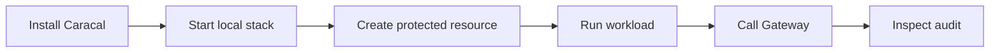

Caracal gives AI agents and automated workflows short-lived, policy-approved authority instead of long-lived provider credentials in code or environment files. An agent asks for scoped authority when it acts, policy decides before the action reaches a resource, the Gateway or a verified service enforces the result, and audit records what happened.

Use this section when you want the fastest path from a clean machine to a real protected call.

## Should You Use Caracal?

Caracal fits when agents, services, or automation need to call APIs, tools, SaaS providers, or data systems without directly holding the upstream credential.

| Question | Use Caracal when |
| --- | --- |
| Do agents need credentials? | Agents need scoped access to tools, APIs, providers, or data. |
| Do you need policy before execution? | Access must be allowed or denied before the protected action happens. |
| Do you need revocation? | Active authority must end centrally without restarting every workload. |
| Do you need audit evidence? | You need to explain which app, run, policy, resource, and result were involved. |

Caracal is not an LLM framework, prompt router, agent scheduler, static config store, general API gateway, or identity provider. If you only have human users behind a normal login, start with an IdP instead.

:::note[Managed option]
This section covers the self-hosted open-source edition. If you want managed multi-tenancy, hosted management, SSO, or a supported enterprise deployment, see [Enterprise Edition](/enterprise/).
:::

## First Success Path

The onboarding path keeps runtime lifecycle in the `caracal` CLI and product management in the Console:

1. Install `caracal` and `caracal-console`.
2. Start the local stack with `caracal up`.
3. Open Console guided setup with `caracal console`.
4. Create one zone, agent app, resource, policy, and runtime profile.
5. Run a workload with `caracal run --` or an SDK.
6. Call the protected resource through the Gateway.
7. Inspect **audit** and **explain** in the Console.

## Core Terms

| Term | Meaning |
| --- | --- |
| Agent app | The registered workload identity that asks Caracal for authority. |
| Agent session | One tracked execution of an agent app. |
| Resource | The protected API, tool, provider, service, or data target. |
| Policy | The rules that allow or deny requested resource scopes. |
| Mandate | The short-lived signed token Caracal issues after policy allows access. |
| Gateway | The default boundary that verifies mandates, routes requests, brokers provider credentials when needed, and records action-result audit. |
| Audit | The decision and result trail for authorization, execution, revocation, and diagnostics. |

You can finish Get Started with only these terms. Use [Concepts](/concepts/) when you need the deeper authority, delegation, revocation, and audit model.

## Choose Your Next Path

| Goal | Start here | You will have |
| --- | --- | --- |
| Evaluate Caracal locally | [Install Caracal](./install-caracal/) | A verified CLI, Console, and local Docker prerequisite. |
| Protect one resource end to end | [First Protected Call](./first-protected-call/) | A Gateway-routed resource, active policy, runtime profile, and audit explanation. |
| Add Caracal to app code | [Add SDK to Your App](./add-sdk-to-your-app/) | TypeScript, Python, or Go code that opens an agent session and calls the Gateway. |
| Fix a blocked first run | [First-Run Troubleshooting](./first-run-troubleshooting/) | A focused checklist for readiness, profile, STS, Gateway, upstream, and audit issues. |
| Learn the full model | [Caracal Mental Model](/concepts/model-overview/) | The canonical concept path after first success. |
| Develop Caracal itself | [Set Up Locally](/contributing/setup/) | A source-tree development stack and contributor workflow. |

## Next Step

Continue with [Install Caracal](./install-caracal/).
