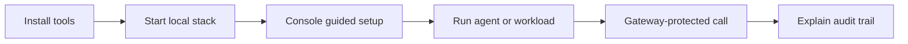

Caracal is an authority plane for AI agents and autonomous workflows. It gives each agent app short-lived, scoped access to tools, APIs, providers, and data only after policy allows the request, then records the authorization decision and the action result.

Start here if you want the fastest path from a clean machine to a real protected call.

## The first successful path

The onboarding path deliberately keeps product management in the Console and local runtime lifecycle in the `caracal` runtime CLI:

1. Install `caracal` and `caracal-console`.
2. Start the local stack with `caracal up`.
3. Open the Console with `caracal console`.
4. Use **guided setup** to create or select a zone, agent app, provider, resource, policy, and runtime profile.
5. Run a workload with the SDK or with `CARACAL_CONFIG=... caracal run --`.
6. Call the protected resource through the Gateway.
7. Open **audit** and **explain** in the Console to see why access was allowed or denied.

## Pick your route

| If you are... | Read these pages first | You will end with |
| --- | --- | --- |
| Evaluating Caracal locally | [Installation](./installation/) → [Quickstart](./quickstart/) → [Five-Minute Setup](./five-minute-setup/) | A local stack, a protected resource, and an audit explanation. |
| Integrating an app or agent | [Welcome](./welcome/) → [First Integration](./first-integration/) → [Tutorials](/tutorials/) | SDK code that opens an agent session and calls a Gateway-protected resource. |
| Owning policy or operations | [What Caracal Does](./what-caracal-does/) → [Key Ideas](./key-ideas/) → [Runtime and Console](/runtime-console/) | A clear map of STS, Gateway, Coordinator, Audit, policies, and Console workflows. |
| Contributing to Caracal | [Contributor Quickstart](./contributor-quickstart/) → [Contributing](/contributing/) | A source-tree stack using workspace commands. |

## Pages in this section

| Page | Use it when |
| --- | --- |
| [Welcome](./welcome/) | You want the short product orientation before installing anything. |
| [Installation](./installation/) | You need the released binaries, SDK packages, platform support, or source-tree prerequisites. |
| [Quickstart: Released Product](./quickstart/) | You have installed the tools and want to start the local stack. |
| [Five-Minute Setup](./five-minute-setup/) | You want to protect one resource and verify the first Gateway call. |
| [First Integration](./first-integration/) | You are wiring TypeScript, Python, or Go agent code through Caracal. |
| [Key Ideas at a Glance](./key-ideas/) | You want the vocabulary and model in one page. |
| [What Caracal Does](./what-caracal-does/) | You want to understand the system after seeing one run. |
| [Contributor Quickstart](./contributor-quickstart/) | You are running Caracal from this repository. |

## Prerequisites

- Docker 24+ with the Compose v2 plugin.
- `curl` or `wget` on Linux/macOS, or PowerShell on Windows.
- Node.js, Python, or Go only when you install an SDK for your application.

If you are not sure where to begin, go straight to [Installation](./installation/).
