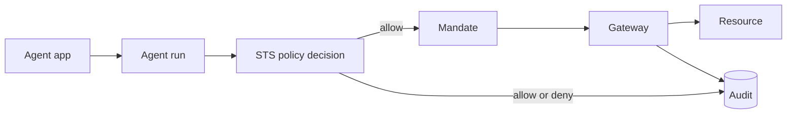

Caracal has one core promise: an agent receives only the authority it needs, only after policy allows the request, and every decision is auditable.

## The workflow in one diagram



## Learn five names first

| Term | Meaning |
| --- | --- |
| Agent app | The registered workload identity that asks Caracal for authority. |
| Agent run | One tracked execution of an agent app. |
| Mandate | The short-lived signed token Caracal issues after policy allows access. |
| Resource | The protected tool, API, provider, service, or data target. |
| Delegated permission | A narrowed authority path from one agent run to another. |

Everything else supports those terms. Use this vocabulary in onboarding and product workflows; use the precise reference names in APIs, policy, and architecture docs.

## Vocabulary map

| Product term | Reference term | Where it appears |
| --- | --- | --- |
| Agent app | Application / principal | Console, policy input, SDK config. |
| Agent run | Execution session / agent session | Coordinator, sessions, audit. |
| Mandate | Caracal access token | STS, Gateway, SDK transport. |
| Resource | Resource identifier | Gateway routing, policy, grants. |
| Delegated permission | Delegation edge | Multi-agent workflows and revocation. |
| Restriction | Constraint | Delegation TTL, hop, budget, resource, scope, and policy limits. |

## What each object does

### Zone

A zone is the tenant or environment boundary. It owns applications, resources, providers, policies, signing keys, revocation state, and audit data.

### Agent app

An agent app is the workload identity. It authenticates to Caracal with an app secret, starts agent runs, requests scoped mandates, and appears in audit records. The app secret is not a provider credential.

### Resource

A resource is the protected target. It includes scopes and, when Gateway routing is needed, an upstream URL and Gateway application binding. Stable scope names such as `calendar:read` or `payments:submit` are easier to govern than prose-like scopes.

Gateway resources can also bind to a provider when the upstream API requires provider-native authentication. Direct resources continue to use Caracal mandates; provider credentials are only brokered inside the trusted Gateway/STS boundary.

### Policy

Policy decides whether a request for a resource and scope set is allowed. If no active policy set exists, access is denied. New users should start with the Console-generated starter policy and tighten it after the first successful run.

### Gateway

The Gateway is the default execution boundary. It verifies Caracal mandates, checks replay and revocation, resolves resource routing, brokers provider credentials inside the trusted boundary, forwards the upstream request, and writes action-result audit.

## Credential boundaries

| Credential | Who holds it | Purpose |
| --- | --- | --- |
| Agent app secret | Runtime profile, deployment secret store, or workload secret manager. | Authenticates the app to Caracal. |
| Mandate | Agent runtime. | Proves Caracal allowed a scoped action. |
| Provider credential | STS/Gateway boundary or a contract-complete adapter. | Authenticates to the upstream provider. |

Provider-native credentials should not be copied into agent code. API keys, bearer tokens, OAuth client secrets, and delegated provider tokens stay sealed at rest and are only opened by trusted services when Gateway executes the upstream request.

## Delegation rule

```text
source = delegator
target = receiver
receiver uses the delegated permission
```

The source does not get to use the receiver's delegated permission. Every delegation narrows authority through explicit resource, scope, TTL, hop, budget, and policy constraints.

## Audit rule

Authorization audit answers **why access was allowed or denied**. Action-result audit answers **what happened when the protected call was executed**.

Together they should answer:

- Which app and run made the request?
- Which resource and scopes were requested?
- Which policy version decided it?
- Which delegation edge was involved?
- Did the Gateway or verified service execute the action successfully?
- Was anything interrupted by revocation?

## Integration paths

| Path | Status | Use it when |
| --- | --- | --- |
| Gateway-mediated HTTP | Implemented default | The protected resource is HTTP, REST, MCP-over-HTTP, or another Gateway-routable upstream. |
| Connector-verified service/tool | Supported pattern | You own the service boundary and can verify mandates, revocation, replay protection where needed, and result audit there. |
| Application-managed provider call | Supported attribution pattern | Your application must call a provider directly and can attach Caracal context, but Caracal is not the provider enforcement boundary. |
| Native broker plugins | Future direction | Provider credential brokering moves behind a plugin contract. |

Start with Gateway-mediated HTTP unless you have a clear reason and complete enforcement contract for another path.
