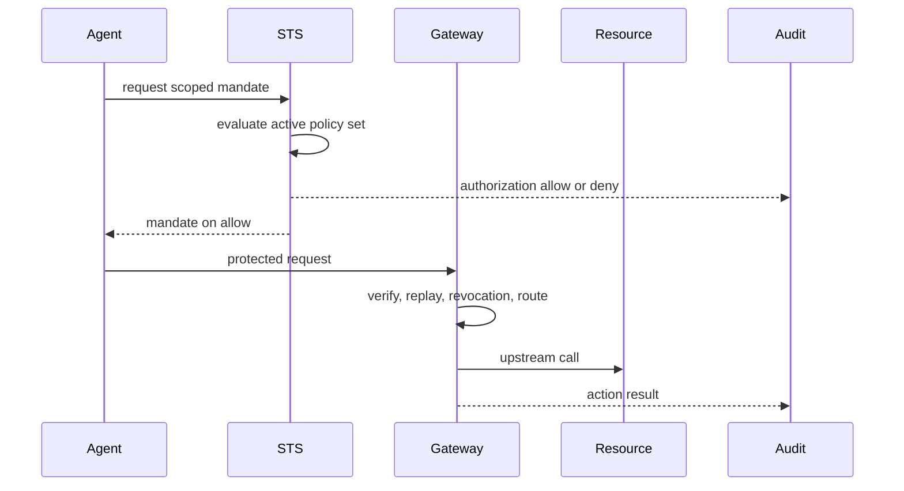

Read this after the quickstart or first integration. It explains what happened when your agent asked for authority and called a protected resource.

## What happened during the first run

1. The SDK or `caracal run` authenticated the agent app to the STS.
2. The STS evaluated the active policy set for the requested resource and scopes.
3. On allow, the STS signed a short-lived mandate and wrote authorization audit.
4. The agent presented that mandate to the Gateway.
5. The Gateway verified the token, checked replay and revocation, resolved the resource route, and called the upstream.
6. The Gateway wrote action-result audit with status, latency, auth mode, and result class.



## The problem Caracal solves

AI agents need access to tools, APIs, SaaS providers, and data. Long-lived provider credentials in agent code make that access hard to scope, revoke, and explain.

Caracal separates provider credentials from agent authority. Agents receive Caracal mandates. The Gateway or a verified service enforces those mandates and handles provider credentials only inside the trusted boundary.

## The authority-plane model

Caracal's product model is intentionally small:

| Product object | Role |
| --- | --- |
| Agent app | The workload identity requesting authority. |
| Agent session | One tracked execution of that workload. |
| Mandate | The short-lived scoped credential issued after policy allows access. |
| Resource | The protected target being accessed. |
| Delegated permission | A narrowed authority path from one run to another. |
| Audit event | Evidence for authorization decisions, actions, revocation, and diagnostics. |

SDK helpers, connectors, Gateway routing, MCP transport, and provider credential brokering exist to preserve this model at execution boundaries.

## The STS decides before execution

The STS is the only place a mandate is born. Before signing one, it:

1. Receives the authenticated app and requested resource/scopes.
2. Loads the active policy set for the zone.
3. Evaluates policy with app, resource, scopes, run state, delegation state, and trace context.
4. Signs a mandate only when policy returns an allow decision.
5. Writes audit for both allows and denies.

If no policy set is active, access is denied. There is no default-allow state.

## The Gateway enforces at the resource boundary

For Gateway-routed calls, the Gateway:

1. Verifies the mandate signature against the zone key.
2. Checks replay protection and revocation anchors.
3. Resolves the resource route and upstream URL.
4. Brokers provider credentials when the route requires them.
5. Forwards the request.
6. Emits action-result audit.

The agent never receives the provider-native credential in this path.

## Delegation narrows authority

Delegation lets one agent session give another session narrower permission. The invariant is:

```text
source = delegator
target = receiver
receiver uses the delegated permission
```

Parenthood does not automatically grant access. Each delegated permission narrows authority through resource, scope, TTL, hop, budget, and policy constraints. Revoking an edge terminates downstream authority.

## Audit explains what happened and why

Authorization audit answers:

- Was the requested mandate allowed or denied?
- Which app, resource, scopes, policy, and policy set were involved?
- Which delegation edge constrained the request?

Action-result audit answers:

- Did the protected call reach the upstream?
- Which route and auth mode were used?
- Did the upstream succeed, fail, or get interrupted by revocation?

Use the Console **audit** view to search events and **explain** to inspect a request ID. The Console is the product surface for audit inspection; the runtime CLI does not expose product-management audit commands.

## What Caracal is not

Caracal does not replace your LLM framework, prompt router, agent scheduler, or provider SDK. It does not inspect prompts or tool-call content. It controls whether a protected action may happen, which credential is used at the boundary, how the action is audited, and how quickly authority can be revoked.

## Provider flow patterns

| Pattern | Status | Enforcement meaning |
| --- | --- | --- |
| Gateway-mediated HTTP | Implemented default | Gateway verifies the mandate, checks replay and revocation, brokers provider credentials, proxies the call, and writes action-result audit. |
| Connector-verified service/tool | Supported pattern | Your service verifies mandates and revocation at its boundary and emits service-side result audit. |
| Application-managed external provider call | Supported attribution pattern | Your application calls the provider directly and attaches Caracal context for traceability; the provider call is not Caracal-enforced unless your code performs the same checks. |
| Native broker plugins | Future direction | Provider credential brokering may move behind a plugin contract. |

## Next step

Read [Key Ideas at a Glance](./key-ideas/) for the compact vocabulary, or continue to [Tutorials](/tutorials/) for outcome-based walkthroughs.
