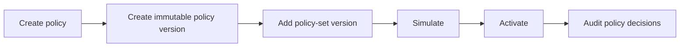

The STS evaluates the active policy-set version for a zone. Activation is explicit so policy changes can be reviewed, simulated, and rolled out without mutating old versions.

## The mental model

Four immutable layers separate authoring from what runs:

| Layer | What it is | Mutable? |
| --- | --- | --- |
| Policy | A named Rego document. | The name; content is versioned. |
| Policy version | One immutable snapshot of policy content. | No. |
| Policy-set version | An immutable bundle of policy versions. | No. |
| Active policy-set version | The one bundle the STS evaluates for a zone. | The pointer moves on activation. |

You edit by creating a **new** version and moving the active pointer to it.
Nothing already evaluated is ever rewritten, so every audit decision ties back to
the exact policy-set version and manifest hash that produced it.

## Activation flow



## Console workflow

1. Open `caracal console`.
2. Select `policy` and create or update the Rego policy.
3. Select `policy set` and create a set for the zone.
4. Add the policy version to a new policy-set version.
5. Simulate the version with a representative input.
6. Activate the version when the simulated decision matches the intended behavior.
7. Use `audit` and `request trace` after the first real request.

## Automation workflow

```ts
import { AdminClient } from "@caracalai/admin";

const admin = new AdminClient({
  apiUrl: process.env.CARACAL_API_URL!,
  adminToken: process.env.CARACAL_ADMIN_TOKEN!,
});

const policy = await admin.policies.create(process.env.CARACAL_ZONE_ID!, {
  name: "payments-read",
  content: policySource,
});

const set = await admin.policySets.create(process.env.CARACAL_ZONE_ID!, "payments");
const version = await admin.policySets.addVersion(process.env.CARACAL_ZONE_ID!, set.id, [
  { policy_version_id: policy.version.id },
]);

const simulation = await admin.policySets.simulate(process.env.CARACAL_ZONE_ID!, set.id, version.id, sampleInput);
if (!simulation.would_activate) {
  throw new Error(simulation.explanation.reason);
}

await admin.policySets.activate(process.env.CARACAL_ZONE_ID!, set.id, version.id);
```

## Validation checklist

| Check | Expected result |
| --- | --- |
| Policy validation | `valid: true` and no blocking warnings. |
| Simulation | Representative input returns the intended decision. |
| Activation | Zone has the expected active policy-set version. |
| First exchange | Audit shows the new policy as a determining policy. |

If activation changes expected access, keep the old policy-set version ID in the rollout notes so you can promote it again if needed.

## Iterate from real denials

Every denied decision links to the policy-set version that produced it, and the
audit explain endpoint reconstructs the policy input for that denial. Stage the
fix as a new policy-set version, then simulate the denied input against it:

```ts
const trace = await admin.audit.explain(zoneId, requestId);
const input = trace.denied[0]?.policy_input;
const candidate = await admin.policySets.addVersion(zoneId, set.id, manifest);
const check = await admin.policySets.simulate(zoneId, set.id, candidate.id, input);
if (check.result?.decision === "allow") {
  await admin.policySets.activate(zoneId, set.id, candidate.id);
}
```

The [Iterate Policy Safely example](/examples/policy-iterate/) wraps this loop as a runnable script.
