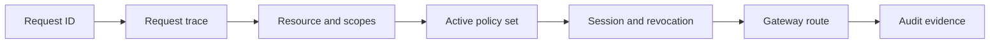

Use this guide when a request is denied, unexpectedly allowed, missing audit evidence, or routed to the wrong protected resource. For production incidents and dependency failures, use the [Troubleshooting Decision Tree](/operations/troubleshooting/).

## Debug Flow



## Start with the Request ID

Find the request ID from the SDK error, STS response, Gateway response, Console audit event, or application log. Open Console **request trace** and paste it.

The trace should show:

- application and execution session;
- requested resource and scopes;
- policy set version;
- determining policies;
- diagnostics;
- final decision;
- Gateway result when the request reached Gateway.

If you do not have a request ID, reproduce the request with the generated profile and capture the SDK, STS, or Gateway output.

## Common Authorization Failures

| Symptom | Check | Fix |
| --- | --- | --- |
| Exchange is denied | Active policy does not allow the application, subject, resource, or scopes. | Update the Rego policy, simulate the denied input, and activate a new policy-set version. |
| Scope is missing | Resource does not define the scope, or policy allowlist omits it. | Add the scope to the resource and policy deliberately. |
| Wrong resource is evaluated | App used the wrong resource ID or Gateway header. | Use the resource ID from Console and `X-Caracal-Resource`. |
| Policy change has no effect | New policy version is not in the active policy-set version. | Create and activate a new policy-set version. |
| Access continues after revocation | Resource server is not consuming revocation state, or Gateway route is not used. | Confirm Gateway-mediated routing or shared revocation consumers for connectors. |
| Gateway returns 403 | Mandate is expired, missing, revoked, or scoped for another resource. | Rerun the workload for a fresh mandate and confirm resource bindings. |
| Upstream succeeds without audit | Request bypassed Gateway or connector result audit. | Route through Gateway or emit service-side action-result audit after connector verification. |
| No audit event appears | Request never reached STS/Gateway, wrong zone is selected, or audit ingestion is delayed. | Confirm profile, selected zone, and request ID; refresh audit after a short wait. |

## Iterate from a Denial

Every denied decision links to the policy-set version that produced it. The audit explain endpoint reconstructs a redaction-safe policy input for denied decisions:

```ts
const trace = await admin.audit.explain(zoneId, requestId);
const input = trace.denied[0]?.policy_input;
```

Feed that input into [simulation](/guides/activate-policy-set/) against a candidate policy-set version before activating the fix. Actor and subject claims are never written to audit, so add any claim-dependent fields before simulating.

## Authorization Design Rules

- Allow only the scopes an application and subject need.
- Keep policies resource-specific instead of allowing broad cross-resource access.
- Express context-sensitive conditions in policy rather than widening scopes.
- Revoke active sessions when a subject leaves a workflow or an application no longer needs a resource.
- Use diagnostics for expected denial paths so request traces explain what to change.

## Related Pages

- [Define Resources and Providers](/guides/resources-providers/)
- [Author a Rego Policy](/guides/author-policy/)
- [Activate a Policy Set](/guides/activate-policy-set/)
- [Resources and Grants](/concepts/resource-grant/)
- [Policies and Policy Sets](/concepts/policy/)
- [Sessions and Revocation](/concepts/sessions-revocation/)
