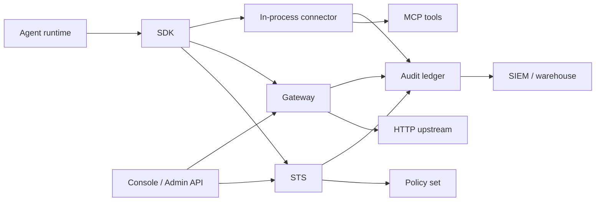

Production deployments usually combine the Gateway, connectors, SDKs, revocation consumers, audit export, and policy automation. Keep the same authority model, then place enforcement where it best fits the system.

## Pick an Enforcement Pattern

| Pattern | Use when | Primary guide |
| --- | --- | --- |
| Gateway-routed HTTP | You can route traffic through Caracal before it reaches the upstream. | [Protect a Gateway-Routed HTTP API](/guides/protect-gateway-http/) |
| In-process connector | The resource server owns verification inside its framework. | [Protect an Express App](/guides/protect-express/), [Protect a FastMCP App](/guides/protect-fastmcp/), [Protect a Go net/http Service](/guides/protect-nethttp/) |
| MCP transport | You need framework-neutral MCP bearer verification. | [Protect an MCP Server](/guides/protect-mcp/) |
| SDK transport injection | Provider SDK accepts custom fetch, transport, or HTTP client hooks. | [SDK guides](/guides/) |
| Batch or queue worker | Work runs outside request/response but still needs scoped mandates. | [Run an Agent with caracal run](/guides/runtime-run/) |

## Reference Architecture

## Production Checklist

| Area | Requirement |
| --- | --- |
| Zones | Separate production, staging, and customer trust boundaries. |
| Keys | Rotate zone signing keys and verify JWKS refresh behavior. |
| Profiles | Generate runtime profiles through guided setup; keep secret files locked down. |
| Revocation | Use shared revocation stores and stream consumers, not process-local memory. |
| Policy | Validate, simulate, version, activate, and audit policy-set changes. |
| Audit | Export decisions and diagnostics to operational monitoring or SIEM. |
| Step-up | Route sensitive approvals through an external proof system or reviewer workflow. |

## Integration Notes

- For FastAPI or ASGI services, use the Python SDK context middleware for propagation and the MCP transport primitives for mandate verification.
- For gRPC, carry Caracal headers or metadata through the gateway/client interceptor layer and verify mandates at the service edge.
- For service mesh deployments, keep Caracal authority at the application layer; mesh identity does not replace resource scopes or policy decisions.
- For provider SDKs, use the SDK `transport()` or language equivalent when the provider accepts a custom HTTP transport.

## Validate After Rollout

Run a successful request, a denied request, a revoked-session request, and a step-up request. Confirm each one has an audit trail and that operators can explain the final decision from the Console.
