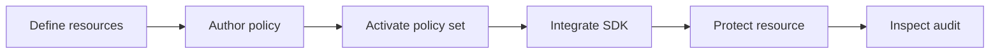

Use these guides after you finish [Get Started](/get-started/) and understand the [Concepts](/concepts/). Each guide starts from a real task and points back to the canonical concept page instead of repeating the model.

## Choose a path

| Goal | Start with |
| --- | --- |
| Add Caracal to application code | [TypeScript SDK](/guides/sdk-typescript/), [Python SDK](/guides/sdk-python/), or [Go SDK](/guides/sdk-go/) |
| Protect a resource server | [Express](/guides/protect-express/), [FastMCP](/guides/protect-fastmcp/), [Go net/http](/guides/protect-nethttp/), or [MCP transport](/guides/protect-mcp/) |
| Map your architecture onto Caracal | [Modeling Recipes](/guides/modeling-recipes/) |
| Configure authority | [Define Resources and Providers](/guides/resources-providers/), [Author a Rego Policy](/guides/author-policy/), [Activate a Policy Set](/guides/activate-policy-set/), and [Authorize Access](/guides/authorize-access/) |
| Run and inspect agents | [Run an Agent with caracal run](/guides/runtime-run/), [Implement Multi-Agent Delegation](/guides/delegation/), and [Tail and Query the Audit Stream](/guides/audit-stream/) |
| Handle sensitive resources | [Step-Up Re-Authentication](/guides/step-up/) |
| Design larger deployments | [Enterprise Runtime Patterns](/guides/enterprise-runtime-patterns/) |

## Recommended order

## Surface boundaries

Use the right surface for each task:

| Surface | Use for |
| --- | --- |
| `caracal up`, `down`, `status`, `purge`, `run`, `console` | Local runtime lifecycle and subprocess injection. |
| Console | Human-facing zone, application, provider, resource, policy, session, audit, explanation, delegation, and diagnostic workflows. |
| Admin API and `@caracalai/admin` | Automation for the same control-plane objects. |
| SDKs and connectors | Application integration, context propagation, mandate exchange, and mandate verification. |

## Before you start

You need a running Caracal runtime, a zone, an application, at least one resource, and an active policy set. The [five-minute setup](/get-started/five-minute-setup/) creates that baseline.
