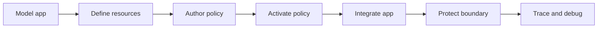

Use Guides after [Get Started](/get-started/) or the [Tutorials](/tutorials/) when you know the task you need to complete. You do not need to read every concept first; each guide links to the canonical concept page when the model matters.

## Choose by Task

| Task | Start with |
| --- | --- |
| Map your architecture onto Caracal | [Model Your Application in Caracal](/guides/modeling-recipes/) |
| Define protected targets and upstream credentials | [Define Resources and Providers](/guides/resources-providers/) and [Provider Recipes](/guides/provider-recipes/) |
| Write and activate authorization logic | [Author a Rego Policy](/guides/author-policy/) and [Activate a Policy Set](/guides/activate-policy-set/) |
| Debug an authorization result | [Debug Authorization Decisions](/guides/authorize-access/) |
| Add Caracal to app code | [TypeScript SDK](/guides/sdk-typescript/), [Python SDK](/guides/sdk-python/), or [Go SDK](/guides/sdk-go/) |
| Run an existing process with Caracal tokens | [Run an Agent with caracal run](/guides/runtime-run/) |
| Protect a Gateway-routed HTTP upstream | [Protect a Gateway-Routed HTTP API](/guides/protect-gateway-http/) |
| Protect a resource server in process | [Express](/guides/protect-express/), [FastMCP](/guides/protect-fastmcp/), [Go net/http](/guides/protect-nethttp/), or [MCP server](/guides/protect-mcp/) |
| Add delegation, audit export, or step-up | [Delegation](/guides/delegation/), [Audit Stream](/guides/audit-stream/), or [Step-Up Re-Authentication](/guides/step-up/) |
| Plan a production integration | [Production Integration Patterns](/guides/enterprise-runtime-patterns/) |

## Recommended Order

## Surface Boundaries

Use the right surface for each task:

| Surface | Use for |
| --- | --- |
| `caracal up`, `down`, `status`, `purge`, `run`, `console` | Local runtime lifecycle and subprocess injection. |
| Console | Human-facing zone, application, provider, resource, policy, session, audit, explanation, delegation, and diagnostic workflows. |
| Admin API and `@caracalai/admin` | Automation for the same control-plane objects. |
| SDKs and connectors | Application integration, context propagation, mandate exchange, and mandate verification. |

## Before You Start

You need a running Caracal runtime, a zone, an application, at least one resource, and an active policy set. [First Protected Call](/get-started/first-protected-call/) creates that baseline.
