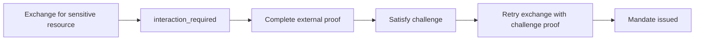

Step-up happens when policy denies an exchange with a diagnostic that asks for fresh proof. The STS returns `interaction_required` and a challenge ID instead of a mandate.

## Flow



## TypeScript handling

```ts
import { OAuthClient, InteractionRequiredError } from "@caracalai/oauth";

const oauth = new OAuthClient(
  process.env.CARACAL_STS_URL!,
  process.env.CARACAL_ZONE_ID!,
  process.env.CARACAL_APPLICATION_ID!,
);

try {
  await oauth.exchange(subjectToken, "resource://pipernet", {
    scopes: ["pipernet:refund"],
  });
} catch (error) {
  if (error instanceof InteractionRequiredError) {
    console.log(error.challengeId, error.acrValues);
  } else {
    throw error;
  }
}
```

## Satisfy the challenge

Use the Console for human approval or the Admin API when an external proof system has already completed. The Admin API supports challenge inspection and satisfaction under the zone step-up challenge routes.

```bash
curl -X POST \
  "$CARACAL_API_URL/v1/zones/$CARACAL_ZONE_ID/step-up-challenges/$CHALLENGE_ID/satisfy" \
  -H "Authorization: Bearer $CARACAL_ADMIN_TOKEN" \
  -H "Content-Type: application/json" \
  -d '{"approver_subject_id":"reviewer-123"}'
```

The approver must be different from the challenged session subject.

## Retry exchange

Retry token exchange only after the challenge is satisfied. The STS validates the challenge proof and returns a mandate when policy and session checks pass.

## Troubleshooting

| Symptom | Check |
| --- | --- |
| No `challenge_id` | Confirm the policy emits a `step_up_required` diagnostic. |
| Challenge cannot be satisfied | Confirm it has not expired, was not consumed, and is not self-approved. |
| Retry still denied | Inspect `request trace`; policy may require a different resource, scope, or challenge type. |
| Too many attempts | Wait for the STS step-up throttle window or investigate repeated proof failures. |

Related pages: [Step-Up Challenges](/concepts/step-up/) and [Author a Rego Policy](/guides/author-policy/).
