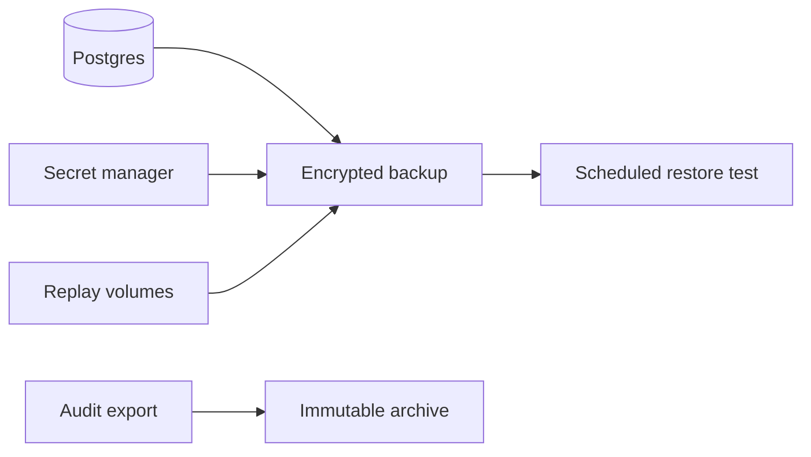

Backups must preserve both access state and evidence state. A restore that loses audit, revocation, keys, or delegation data can produce unsafe or unauditable behavior.

## What to Protect

| Asset | Why it matters |
| --- | --- |
| Postgres database | Product state, policies, grants, sessions, audit events, agents, delegations, outboxes, gateway bindings. |
| Runtime secrets | Database/Redis credentials, admin token, Coordinator token, zone KEK, HMAC keys, service exchange keys. |
| STS/Gateway replay volumes | Audit replay files during Redis/Audit outages. |
| Redis snapshot or managed backup | Optional operational recovery for stream pending entries; Postgres remains authoritative. |
| Audit exports | Long-term evidence and SIEM/compliance integration. |

## Backup Flow

## Retention Controls

| Area | Controls |
| --- | --- |
| Audit database | `AUDIT_RETENTION_DAYS`, partitions, audit export watermarks. |
| Coordinator data | `DELEGATION_RETENTION_DAYS`, `OUTBOX_RETENTION_DAYS`, sweeper intervals. |
| Redis streams | Provisioner intended max lengths and managed Redis retention. |
| Backups | Platform backup policy and legal/compliance requirements. |

## Restore Validation

1. Restore Postgres into an isolated environment.
2. Restore required secrets into the environment secret store.
3. Run migration verification.
4. Start services and verify `/ready`.
5. Confirm audit query, policy-set activation state, Gateway bindings, sessions, agents, and delegation records.
6. Run a canary token exchange and protected Gateway request.

## Troubleshooting

| Symptom | Check |
| --- | --- |
| Restored STS cannot decrypt keys | `ZONE_KEK` does not match the database secrets. |
| Audit chain verification fails | Missing audit rows, wrong `AUDIT_HMAC_KEY`, or partial restore. |
| Gateway cannot route | Missing gateway binding rows or stale binding revision. |
| Revocation state is incomplete | Restore Postgres revocation/session state and replay Redis revocation events where needed. |

## Next Step

Use [Respond to Incidents](/operations/incident-response/) to define containment, evidence preservation, and recovery validation.
