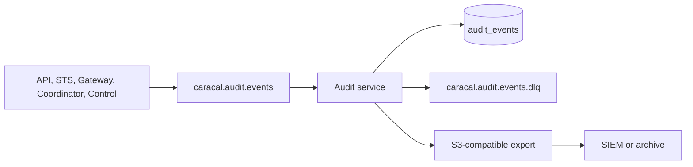

Caracal audit records provide decision evidence for STS, Gateway, Coordinator, policy evaluation, Control, and administrative activity. Treat audit as a protected evidence pipeline.

## Evidence Path

Audit events are HMAC-protected in published modes. Audit storage includes tamper checks and append-only permission validation.

## Integration Points

| Need | Surface |
| --- | --- |
| Search recent events | Console `audit` or Audit API search. |
| Trace one request | Console `request trace` or API request ID lookup. |
| SIEM export | `caracal.audit.events` consumer or Audit export path. |
| Evidence archive | Postgres backup plus object-store export. |
| Tamper response | `CaracalAuditTamperDetected` alert and incident runbook. |

## Operational Controls

- Monitor Audit DLQ, consumer lag, tamper metrics, and export watermarks.
- Preserve audit HMAC keys according to retention requirements.
- Keep audit partitions and backup retention aligned with legal hold requirements.
- Do not manually mutate `audit_events`; verification expects append-only behavior.

## Troubleshooting

| Symptom | Check |
| --- | --- |
| SIEM is missing events | Redis group lag, export watermark, Audit readiness, and network egress. |
| DLQ has HMAC failures | Producer key mismatch or corrupted stream payload. |
| Request explanation missing | Confirm request ID, zone, retention window, and that the protected request reached Caracal. |

## Next Step

Use [Hand Off to Platform Teams](/operations/platform-team-handoff/) when deployment, recovery, audit, alerting, and ownership evidence are ready.
