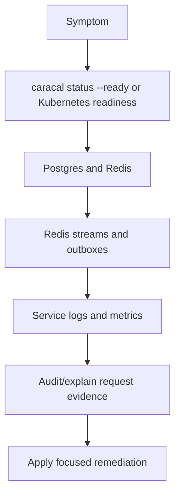

Debug from the boundary inward: runtime lifecycle, readiness, storage, streams, service config, then request-specific audit evidence.

## Triage flow

## Commands

| Environment | Commands |
| --- | --- |
| Local | `caracal status --ready`, `docker compose ps`, `docker compose logs <service>` |
| Helm | `kubectl -n caracal get pods,svc,jobs`, `kubectl -n caracal describe pod <pod>`, `kubectl -n caracal logs <pod>` |
| Storage | `infra/postgres/scripts/validateMigrations.sh`, `infra/redis/scripts/verify.sh` |
| App-level | Console `diagnostics`, `audit`, and `explain` |

## Common cases

| Symptom | Likely area |
| --- | --- |
| `401` or `403` from API | Admin token, scope, Control token, or workload credential source. |
| STS exchange fails | Zone ID, application ID, grant, policy, client secret, step-up, or STS readiness. |
| Gateway fails before upstream | Mandate verification, STS exchange, binding, revocation snapshot, or upstream allowlist. |
| Agent views fail | Coordinator URL/token, selected zone, or Coordinator readiness. |
| Audit event missing | Redis stream health, Audit readiness, DLQ, replay backlog, or request never reaching protected boundary. |

## Request investigation

1. Capture request ID, zone ID, subject, resource, and timestamp.
2. Open Console `audit` or `explain`.
3. Confirm policy decision, scopes, target resource, session, agent session, and delegation edge.
4. Compare token claims with resource-server verifier settings.
5. Check revocation and step-up state when authority appears valid but access fails.

## Escalation bundle

Include readiness output, relevant logs, service versions, Helm values diff, Redis stream status, Postgres migration status, request ID, audit explanation, and any recent secret or policy changes.
