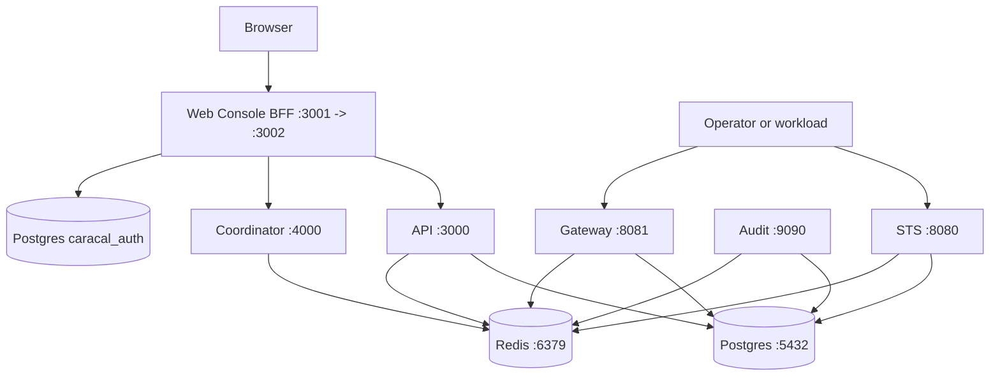

Caracal ships two Compose shapes:

| File | Purpose |
| --- | --- |
| `infra/docker/docker-compose.yml` | Local development stack that builds repository images. |
| `infra/docker/runtime-compose.yml` | Self-hosted runtime stack using versioned GHCR images. |

Both stacks run Postgres, Redis, migrations, STS, API, Gateway, Audit, Coordinator, the packaged web console BFF, and optional Control.

## Topology



The packaged `web` service is the browser entrypoint. It maps `127.0.0.1:3001` on the host to port `3002` in the container, serves the built SPA same-origin, and proxies `/api/console/*` to the internal API and Coordinator. It starts after Postgres, API, and Coordinator are healthy. API, Coordinator, Gateway, and STS remain bound to localhost; the web service is the only browser-facing service in the Compose topology.

## Prerequisites

- Docker with Compose support.
- Generated runtime secrets under the expected secrets directory.
- For the self-hosted runtime file, `CARACAL_VERSION` and optional `CARACAL_REGISTRY`.

## Local Development Flow

```bash
pnpm secrets:init
caracal up
caracal status --ready
bash infra/scripts/smokeTest.sh
```

`caracal up` builds local images in development mode, including `caracal-web` from `infra/docker/Dockerfile.web`; release builds publish the same image from the service-image matrix because `release.config.json` registers it as a runtime-tier container. It writes operator secrets outside the repository under the managed dev secret directory, exports `CARACAL_SECRETS_DIR` to Compose, and keeps the host directory private so only the operator account can mount those files into services. The secret set includes `authDatabaseUrl` for the dedicated `caracal_auth` session database and `caracalAuthSecret` for Better Auth signing. `caracal status --ready` checks dependency readiness, and `smokeTest.sh` probes `/ready` for API, Gateway, STS, Audit, and Coordinator, plus the API `/health` liveness endpoint.

After readiness succeeds, open the packaged console at [http://localhost:3001](http://localhost:3001). Use `caracal web` only when you want the local development launcher backed by the Vite dev server instead of the packaged Compose web service.

## Self-Hosted Runtime Flow

```bash
export CARACAL_VERSION=2026.06.22-rc.1
docker compose -f infra/docker/runtime-compose.yml up -d
docker compose -f infra/docker/runtime-compose.yml ps
bash infra/scripts/smokeTest.sh
```

The runtime compose file expects secrets under `./secrets/` relative to the compose file unless `CARACAL_SECRETS_DIR` points at a platform-managed secret mount. It pulls `caracal-web:v<version>` from GHCR, maps `127.0.0.1:3001` to container port `3002`, and uses `CARACAL_WEB_URL` when the browser origin is not `http://localhost:3001`. Keep the secret directory private to the operator account and never place inline secrets in the compose file.

To move an existing runtime onto a newer release, use `caracal upgrade`. It stages the pinned images, applies expand-phase migrations against the running database, then rolls the services and waits for readiness — no maintenance window. See [Upgrade Caracal](/operations/upgrade/).

## Operator Secret Boundary

Admin, Coordinator, auth signing, database, Redis, HMAC, and KEK material are operator secrets. Do not place those files in a source workspace, agent workspace, MCP tool workspace, or any directory mounted into untrusted agent containers.

| Deployment | Secret location |
| --- | --- |
| Local development through `caracal up` | Managed dev secret directory outside the repository; passed to Compose as `CARACAL_SECRETS_DIR`. |
| Released self-hosted runtime | `$CARACAL_HOME/secrets` or an explicit `CARACAL_SECRETS_DIR`. |
| Cloud or orchestrated deployment | Cloud/Kubernetes secret mount or secret-manager projection passed as `CARACAL_SECRETS_DIR` or service-specific `*_FILE` paths. |

Run agents with workload credentials only. If an agent must execute untrusted code, run it as a separate OS user, container, VM, or sandbox that cannot read `CARACAL_SECRETS_DIR`, `$CARACAL_HOME/secrets`, Docker socket credentials, or repository control-plane files.

## Control Plugin

Control runs as an optional in-process plugin inside the API service rather than a
separate container. Set `CARACAL_CONTROL_ENABLED=true` on API to mount the plugin,
then toggle availability at runtime with the gate file (`CONTROL_GATE_FILE`). Enable
it only when the Console or platform automation is ready to manage Control exposure
and credentials.

## Rollback

1. Stop the stack with `caracal down` or `docker compose ... down`.
2. Restore the previous `CARACAL_VERSION`.
3. Start the stack and wait for readiness.
4. Confirm audit replay and outbox queues drain before reopening high-risk traffic.

## Troubleshooting

| Symptom | Check |
| --- | --- |
| Postgres or Redis never becomes healthy | Check secret files, mounted volumes, and host port conflicts on `5432` or `6379`. |
| API ready fails | Confirm migrations completed and `DATABASE_URL_FILE`, `REDIS_URL_FILE`, and `CARACAL_ADMIN_TOKEN_FILE` resolve. |
| Web console fails readiness | Confirm `authDatabaseUrl`, `caracalAuthSecret`, `caracalAdminToken`, and `caracalCoordinatorToken` are mounted, and that API and Coordinator are healthy. |
| STS or Gateway fails in `rc`/`stable` | Confirm `AUDIT_HMAC_KEY`, `STREAMS_HMAC_KEY`, and `GATEWAY_STS_HMAC_KEY` are hex-encoded and at least 32 bytes. |
| Gateway rejects upstreams | Operator-provisioned private upstreams are allowed by default; if set, confirm the host is in `UPSTREAM_HOST_ALLOWLIST`. Cloud metadata, loopback, CGNAT, and multicast are always blocked. |
| Audit gaps appear after Redis outage | Keep STS and Gateway replay volumes intact and wait for replay metrics to drain. |

## Next Step

Use [Configure Service Environment](/operations/env-vars/) to review required service variables and secret-file settings.
