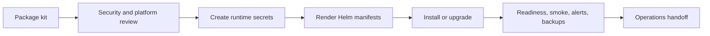

Use the enterprise install kit pattern when a platform team needs a controlled bundle of Caracal deployment assets, values, secrets instructions, verification steps, and rollback guidance. Keep the open-source and enterprise products isolated: do not import, copy, or depend on files across product roots.

## Kit Contents

| Artifact | Purpose |
| --- | --- |
| Release version | Exact Caracal image tag and chart version. |
| Helm values | Environment-specific overrides for registry, tag, secrets, network policy, ingress, resources, replay persistence, and observability. |
| Secret manifest | Required keys and where the platform secret manager stores them. |
| Runbook | Install, verify, rollback, backup, restore, and incident steps. |
| Evidence checklist | Rendered manifest, migration result, readiness output, smoke test, alert wiring, backup proof, and owner sign-off. |

## Required Boundaries

- Keep OSS local ports and enterprise local ports non-overlapping in examples.
- Do not reference private source paths from open-source docs or configs.
- Share behavior only through documented deployment contracts: images, chart values, APIs, event topics, and secrets.
- Keep customer-specific values outside the repository.

## Installation Sequence

## Verification Evidence

| Check | Evidence |
| --- | --- |
| Version pin | Image tags and chart values match the release approval. |
| Secrets | Runtime Secret contains database, Redis, admin, Coordinator, zone KEK, audit HMAC, stream HMAC, and Gateway-STS HMAC material. |
| Network | NetworkPolicy admits only required ingress and egress. |
| Storage | Postgres migrations complete; Redis streams and groups exist. |
| Runtime | `/ready` passes for API, STS, Gateway, Audit, and Coordinator. |
| Observability | ServiceMonitor and PrometheusRule are installed or equivalent alerts exist. |
| Recovery | Backup and restore runbook has been tested for Postgres and runtime secrets. |

## Handoff Package

Include links to [Deploy with Helm](/operations/kubernetes-helm/), [Configure Service Environment](/operations/env-vars/), [Back Up and Retain Data](/operations/backup-retention/), [Configure Alerts](/operations/alerts/), and [Respond to Incidents](/operations/incident-response/).

## Next Step

Use [Hand Off to Platform Teams](/operations/platform-team-handoff/) when the install bundle is ready for production ownership.
