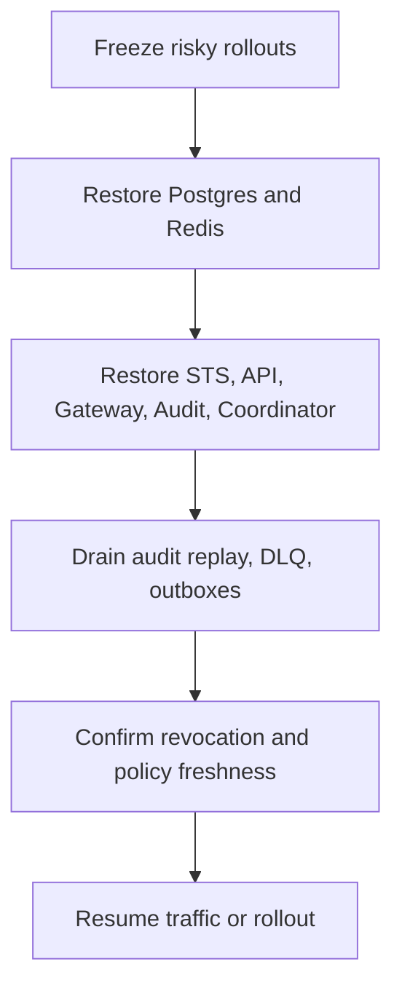

Caracal is designed to fail closed for access-safety boundaries. Recovery should restore evidence, revocation, and policy freshness before reopening risky traffic.

## Failure Matrix

| Failure | User impact | Recovery |
| --- | --- | --- |
| Postgres unavailable | API/STS/Gateway/Audit/Coordinator readiness fails or degrades. | Restore Postgres, confirm migrations, check pools, replay outboxes. |
| Redis unavailable | Streams, revocation, policy invalidation, audit ingestion, and coordination lag. | Restore Redis, verify streams/groups, watch pending entries and replay backlog. |
| STS unavailable | Token exchange and Gateway exchanges fail. | Restore STS readiness, policy bundle freshness, JWKS, and HMAC config. |
| Gateway unhealthy | Protected upstream traffic fails before provider dispatch. | Check bindings, STS exchange, revocation snapshot, upstream allowlist, and audit replay. |
| Audit unhealthy | Evidence ingestion delayed; DLQ or replay grows. | Recover Audit/Postgres/Redis, replay DLQ, verify tamper chain. |
| Coordinator unhealthy | Agent/delegation views and lifecycle management fail. | Restore Coordinator readiness, token, DB, Redis, and sweeper health. |
| Control unhealthy | Automation dispatch unavailable. | Use Console/Admin SDK directly if appropriate; restore Control gate, token, JWKS, Redis, and API reachability. |

## Recovery Order

## Data-Flow Reconciliation

1. Check Postgres migrations and expected tables.
2. Check Redis stream groups and pending entries.
3. Check API and Coordinator outbox tables.
4. Check Audit DLQ and audit replay directories.
5. Check Gateway revocation snapshot freshness.

## Troubleshooting

| Symptom | Action |
| --- | --- |
| Requests fail closed after outage | Confirm STS policy freshness, revocation snapshot, and audit replay drain. |
| Events appear duplicated | Verify idempotent consumers and dedupe keys before manual cleanup. |
| Rollback does not restore service | Schema may have moved forward; roll forward with a compatible fix. |

## Next Step

Use [Run Failure Drills](/operations/failure-drills/) to rehearse the recovery path before a production incident.
