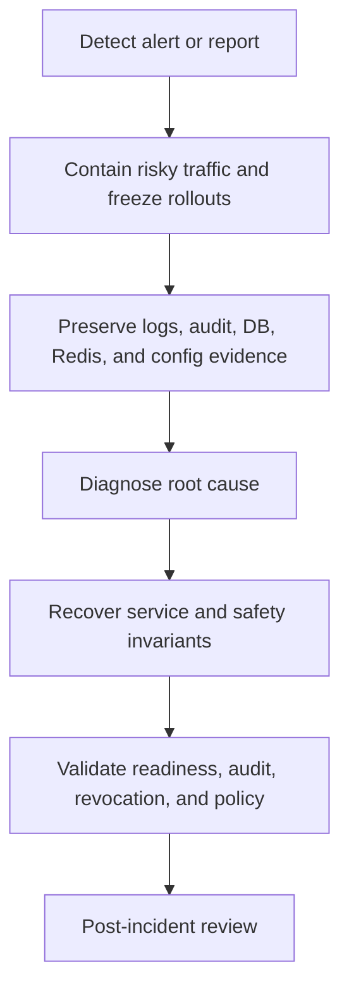

Treat incidents involving audit tamper evidence, stale revocation state, STS/Gateway fail-open risk, secret exposure, or policy corruption as security incidents.

## Severity Triggers

| Trigger | Severity |
| --- | --- |
| `CaracalAuditTamperDetected` | Critical security incident. |
| Gateway revocation snapshot stale or propagation lag | Critical access-safety incident. |
| Gateway STS circuit open during protected traffic | Critical availability/access incident. |
| Audit DLQ growth or replay backlog aging | Critical evidence pipeline incident when sustained. |
| Secret exposure | Critical until rotated and blast radius is understood. |
| Policy activation causes unexpected broad allow | Critical authorization incident. |

## Response Flow

## First-Hour Runbook

| Symptom | Severity | Contain | Preserve | Validate recovery |
| --- | --- | --- | --- | --- |
| Audit tamper alert | Critical | Freeze changes and stop destructive cleanup. | Audit tables, exports, DLQ, service logs. | Tamper sweep result, audit ingestion, and timeline are recorded. |
| Revocation stale | Critical | Fail closed at Gateway or resource servers. | Redis streams, revocation snapshots, session IDs. | Revoked sessions are denied and readiness is stable. |
| Bad policy allow | Critical | Activate last known-good policy set. | Policy set version, request IDs, audit/explain output. | Canary allow/deny decisions match expected policy. |
| Secret exposure | Critical | Rotate exposed material and invalidate affected sessions. | Secret location, key IDs, affected services, audit records. | Old material no longer authenticates. |

## Evidence to Preserve

- Alert name, firing time, and labels.
- Request IDs, zone IDs, resource IDs, policy-set versions, agent session IDs, delegation edge IDs.
- Console audit/explain output.
- Service logs for API, STS, Gateway, Audit, Coordinator, and Control.
- Redis stream status, pending entries, and DLQ contents.
- Postgres backup or snapshot before manual remediation.
- Helm values or Compose config diff.

## Containment Actions

| Incident | Containment |
| --- | --- |
| Audit tamper | Freeze changes, preserve database and audit exports, rotate only after evidence capture. |
| Revocation stale | Fail closed at resource servers or Gateway, restore Redis/Postgres consumers, verify snapshot freshness. |
| Bad policy allow | Activate last known-good policy set, verify canary denies/allows, inspect audit impact. |
| Secret exposure | Rotate exposed material, roll dependent services, invalidate sessions/grants as needed. |

## Recovery Complete When

- Relevant `/ready` endpoints pass.
- Audit DLQ/replay/outbox backlogs are understood or drained.
- Revocation and policy freshness metrics are healthy.
- Canary token exchange and Gateway requests match expected decisions.
- Evidence and timeline are preserved for review.

## Next Step

Use [Plan a Platform Rollout](/operations/platform-rollout-kit/) when the environment is stable and ready for controlled change.
