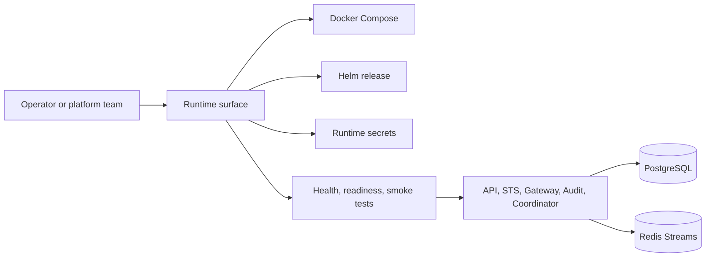

Use Operations when Caracal is running as infrastructure: Docker Compose for self-hosted installs, Helm for Kubernetes, managed Postgres and Redis, production secrets, rollout gates, observability, incident handling, and upgrades.

## Operating model

## First pages by role

| Role | Start with |
| --- | --- |
| Local or self-hosted operator | [Deployment with Docker Compose](/operations/docker-compose/) |
| Kubernetes platform team | [Kubernetes with Helm](/operations/kubernetes-helm/) and [Cloud Reference Deployments](/operations/cloud-reference-deployments/) |
| Security reviewer | [TLS and Production Hardening](/operations/tls-hardening/) and [Key Management and Rotation](/operations/key-management/) |
| SRE/on-call | [Observability and Health](/operations/observability/), [Alerting Recipes](/operations/alerts/), [Failure Modes and Recovery](/operations/failure-modes/), and [Failure Drills](/operations/failure-drills/) |
| Release owner | [Platform Rollout Kit](/operations/platform-rollout-kit/), [Policy Deployment Runbook](/operations/policy-deployment/), and [Upgrade Procedure](/operations/upgrade/) |

## Deployment choices

| Environment | Recommended path | Notes |
| --- | --- | --- |
| Local development | `caracal up` / `infra/docker/docker-compose.yml` | Builds local images, binds service ports to `127.0.0.1`, and writes local secrets. |
| Self-hosted runtime | `infra/docker/runtime-compose.yml` | Uses versioned GHCR images and mounted secrets. |
| Kubernetes | `infra/helm/caracal` | Uses Deployments/StatefulSets, pre-install/pre-upgrade migration Job, ClusterIP Services, optional Ingress, NetworkPolicy, PDBs, HPAs, ServiceMonitor, and PrometheusRule. |

## Core operational invariants

- Postgres is the durable control-plane store.
- Redis Streams move audit, policy invalidation, session revocation, key invalidation, agent, invocation, and delegation events.
- STS and Gateway keep audit replay directories so audit emission can drain after Redis/Audit recovery.
- Published modes are `rc` and `stable`; they require production-grade HMAC keys and reject unsafe fallbacks.
- Product-management operations happen through Console, Admin SDK, or Control API; the top-level runtime CLI only manages local lifecycle and `caracal run`.

## Section map

| Need | Page |
| --- | --- |
| Compose deployment | [Deployment with Docker Compose](/operations/docker-compose/) |
| Helm deployment | [Kubernetes with Helm](/operations/kubernetes-helm/) |
| Runtime profiles | [Environment Variables](/operations/env-vars/) and [Cloud-Native Deployment Profiles](/operations/cloud-native-profiles/) |
| Cloud deployment | [Cloud Reference Deployments](/operations/cloud-reference-deployments/) |
| Storage | [PostgreSQL](/operations/postgres/) and [Redis Streams](/operations/redis/) |
| Hardening | [TLS and Production Hardening](/operations/tls-hardening/) |
| Rotation | [Key Management and Rotation](/operations/key-management/) |
| Scaling | [Scale and Capacity Guidance](/operations/scale-capacity/) |
| Observability | [Observability and Health](/operations/observability/) and [Alerting Recipes](/operations/alerts/) |
| Recovery | [Failure Modes and Recovery](/operations/failure-modes/), [Failure Drills](/operations/failure-drills/), [Backup and Retention](/operations/backup-retention/), and [Incident Response](/operations/incident-response/) |
