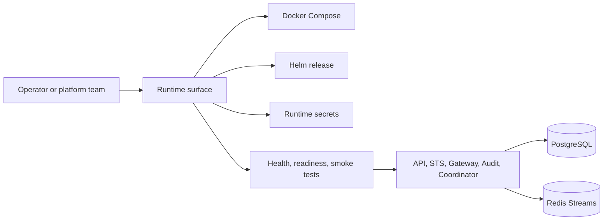

Use Operations when Caracal is running as infrastructure: Docker Compose for self-hosted installs, Helm for Kubernetes, managed Postgres and Redis, production secrets, rollout gates, observability, incident handling, upgrades, and platform handoff.

## Operating Model

## Start by Role

| Role | Start with |
| --- | --- |
| Local or self-hosted operator | [Deploy with Docker Compose](/operations/docker-compose/) |
| Kubernetes platform team | [Deploy with Helm](/operations/kubernetes-helm/) and [Deploy on Managed Kubernetes](/operations/cloud-reference-deployments/) |
| Security reviewer | [Harden Production](/operations/tls-hardening/) and [Rotate Keys and Secrets](/operations/key-management/) |
| SRE or on-call engineer | [Monitor Health and Metrics](/operations/observability/), [Configure Alerts](/operations/alerts/), [Recover from Failures](/operations/failure-modes/), and [Run Failure Drills](/operations/failure-drills/) |
| Release owner | [Plan a Platform Rollout](/operations/platform-rollout-kit/), [Deploy Policy Changes](/operations/policy-deployment/), and [Upgrade Caracal](/operations/upgrade/) |

## Deployment Choices

| Environment | Recommended path | Notes |
| --- | --- | --- |
| Local development | `caracal up` / `infra/docker/docker-compose.yml` | Builds local images, binds service ports to `127.0.0.1`, and writes local secrets. |
| Self-hosted runtime | `infra/docker/runtime-compose.yml` | Uses versioned GHCR images and mounted secrets. |
| Kubernetes | `infra/helm/caracal` | Uses Deployments/StatefulSets, pre-install/pre-upgrade migration Job, ClusterIP Services, optional Ingress, NetworkPolicy, PDBs, HPAs, ServiceMonitor, and PrometheusRule. |

## Core Operational Invariants

- Postgres is the durable control-plane store.
- Redis Streams move audit, policy invalidation, session revocation, key invalidation, agent, invocation, and delegation events.
- STS and Gateway keep audit replay directories so audit emission can drain after Redis/Audit recovery.
- Published modes are `rc` and `stable`; they require production-grade HMAC keys and reject unsafe fallbacks.
- Product-management operations happen through Console, Admin SDK, or Control API; the top-level runtime CLI only manages local lifecycle and `caracal run`.

## Section Map

| Need | Page |
| --- | --- |
| Compose deployment | [Deploy with Docker Compose](/operations/docker-compose/) |
| Helm deployment | [Deploy with Helm](/operations/kubernetes-helm/) |
| Runtime profiles | [Configure Service Environment](/operations/env-vars/) and [Choose a Cloud Profile](/operations/cloud-native-profiles/) |
| Cloud deployment | [Deploy on Managed Kubernetes](/operations/cloud-reference-deployments/) |
| Storage | [Operate PostgreSQL](/operations/postgres/) and [Operate Redis Streams](/operations/redis/) |
| Hardening | [Harden Production](/operations/tls-hardening/) |
| Rotation | [Rotate Keys and Secrets](/operations/key-management/) |
| Scaling | [Scale Capacity](/operations/scale-capacity/) |
| Observability | [Monitor Health and Metrics](/operations/observability/) and [Configure Alerts](/operations/alerts/) |
| Recovery | [Recover from Failures](/operations/failure-modes/), [Run Failure Drills](/operations/failure-drills/), [Back Up and Retain Data](/operations/backup-retention/), and [Respond to Incidents](/operations/incident-response/) |
