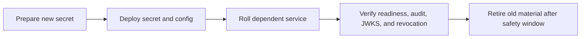

Caracal uses secret material for zone encryption, mandate signing, audit integrity, stream signatures, service exchange, admin access, Coordinator access, database access, and Redis access.

## Key Inventory

| Material | Purpose |
| --- | --- |
| `ZONE_KEK` | Encrypts zone secrets and signing material. |
| Zone signing keys | Sign mandates exposed through STS JWKS. |
| `AUDIT_HMAC_KEY` | Signs/verifies audit evidence. |
| `STREAMS_HMAC_KEY` | Signs Redis stream messages. |
| `GATEWAY_STS_HMAC_KEY` | Authenticates Gateway exchanges to STS. |
| `CARACAL_ADMIN_TOKEN` | Bootstrap/operator API access. |
| `CARACAL_COORDINATOR_TOKEN` | Coordinator agent/delegation management. |
| Postgres and Redis passwords | Storage access. |

## Storage Boundary

Generated operator secrets are file-backed inside a private operator directory. Local development stores them outside the repository; released self-hosted runtimes store them under `$CARACAL_HOME/secrets` unless `CARACAL_SECRETS_DIR` points to another operator-managed directory. Cloud deployments should use the platform secret manager and mount secrets into services through `*_FILE` paths or `CARACAL_SECRETS_DIR`.

Never mount operator secrets into agent workspaces or containers. Agents should receive only application client secrets at provisioning time or short-lived resource mandates from `caracal run`.

## Rotation Principles

- Rotate one class of material at a time.
- Keep old verification material available until existing tokens, stream messages, or audit replay windows drain.
- Verify `/ready`, audit ingestion, revocation propagation, and Gateway exchange after each rotation.
- Record who rotated, when, why, new secret location, and rollback window.

## Suggested Rotation Order

## Rotation Checklist

| Key | Services to roll | Verify |
| --- | --- | --- |
| `ZONE_KEK` | API and STS after coordinated key plan. | Zone secrets decrypt and STS can read active signing material. |
| Zone signing key | STS, then verifiers after JWKS cache windows. | JWKS exposes expected key IDs and old mandates expire or verify during overlap. |
| `AUDIT_HMAC_KEY` | Producers and Audit verifier: API, STS, Gateway, Audit, Control. | Audit ingestion accepts new events and rejects mismatched signatures. |
| `STREAMS_HMAC_KEY` | Producers and consumers: API, STS, Gateway, Coordinator, Audit. | Consumers accept new stream messages and pending entries drain. |
| `GATEWAY_STS_HMAC_KEY` | API, STS, and Gateway. | Gateway exchange succeeds and failed HMAC attempts are denied. |
| `CARACAL_ADMIN_TOKEN` | API, Console/Control clients, Control service. | Old token fails; Console and automation authenticate with the replacement. |
| `CARACAL_COORDINATOR_TOKEN` | Coordinator and Console/operator clients. | Agent/delegation views load and old token fails. |

## Troubleshooting

| Symptom | Check |
| --- | --- |
| JWKS clients reject mandates after rotation | Issuer URL, JWKS cache age, key overlap window, and STS JWKS health. |
| Audit DLQ grows | Producer and Audit `AUDIT_HMAC_KEY` mismatch. |
| Stream consumers reject messages | Producer and consumer `STREAMS_HMAC_KEY` mismatch. |
| Gateway exchange fails | `GATEWAY_STS_HMAC_KEY` mismatch between Gateway and STS. |

## Next Step

Use [Operate PostgreSQL](/operations/postgres/) and [Operate Redis Streams](/operations/redis/) to verify durable state and event propagation.
