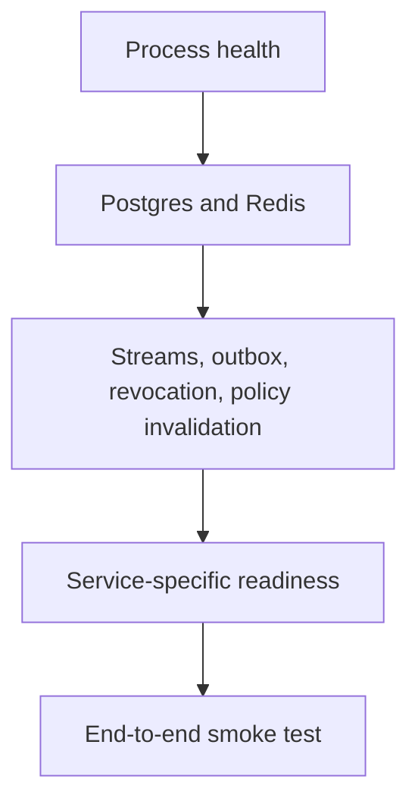

Every service exposes health/readiness endpoints; most services also expose metrics. Use readiness for automation gates and health for liveness.

## Endpoint map

| Service | Health | Readiness | Metrics |
| --- | --- | --- | --- |
| API | `/health` | `/ready` | `/metrics` |
| STS | `/health` | `/ready` | `/metrics`, `/metrics.json` |
| Gateway | `/health` | `/ready` | `/metrics`, `/metrics.json` |
| Audit | `/health` | `/ready` | `/metrics`, `/metrics.json` |
| Coordinator | `/health` | `/ready` | `/metrics` |
| Control | `/health` | `/ready` | Not primary operator surface |

## Readiness ladder



| Rung | What it proves | User-facing impact when it fails |
| --- | --- | --- |
| Process health | The service process can answer liveness. | Restart loops or dead containers. |
| Postgres and Redis | Durable state and stream/cache dependencies are reachable. | Management writes, token exchange, audit, or revocation can fail. |
| Streams and outbox | Event delivery paths are draining. | Decisions may succeed while evidence or invalidation lags. |
| Service readiness | Service-specific invariants are met. | That service should not receive production traffic. |
| End-to-end smoke test | API, STS, Gateway, Audit, and Coordinator work together. | User workflows may fail even when individual services look healthy. |

## Local checks

```bash
caracal status
caracal status --ready
bash infra/scripts/smokeTest.sh
```

`smokeTest.sh` probes API `/ready` and `/health`, Gateway `/ready`, STS `/ready`, Audit `/ready`, and Coordinator `/ready`.

## Kubernetes checks

```bash
kubectl -n caracal get pods
kubectl -n caracal get servicemonitor,prometheusrule
kubectl -n caracal logs deploy/caracal-api
```

Enable `serviceMonitor.enabled` when using Prometheus Operator. Keep chart alert rules enabled or provide equivalent alerts.

## Operator diagnostics

Use Console `diagnostics` for API health, readiness, zone diagnostics, and local preflight checks. Use Console `audit` and `request trace` views for decision investigation.

## Troubleshooting

| Symptom | Check |
| --- | --- |
| Health passes but readiness fails | Dependency, stream, outbox, policy, revocation, or audit readiness. |
| Metrics scrape returns unauthorized | Match scraper bearer token to `METRICS_BEARER`. |
| Readiness flaps | CPU throttling, OOM, Postgres/Redis latency, probe timeouts, or dependency restarts. |
| Smoke test fails only for API `/health` | Confirm the API liveness endpoint responds in the deployment shape being tested. |
