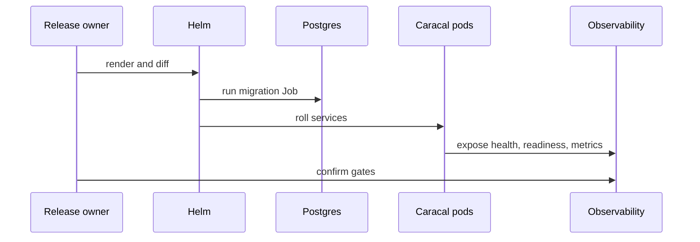

Use this runbook for version upgrades, configuration changes, chart changes, secret rotations, ingress changes, and policy rollout waves.

## Rollout Gates

| Gate | Pass condition |
| --- | --- |
| Source verification | Values, env vars, ports, and secrets match current chart and service config. |
| Render validation | `helm lint` and `helm template` succeed with environment values. |
| Migration safety | Migrations are forward-only and complete before service rollout. |
| Readiness | API, STS, Gateway, Audit, and Coordinator `/ready` endpoints pass. |
| Event health | Redis streams, outbox dispatch, audit ingestion, revocation propagation, and replay backlog are healthy. |
| Rollback plan | Previous image tag, chart revision, values, and compatible schema plan are documented. |

## Rollout Sequence



## Execution

```bash
helm -n caracal diff upgrade caracal infra/helm/caracal -f values.production.yaml
helm -n caracal upgrade caracal infra/helm/caracal -f values.production.yaml
kubectl -n caracal rollout status deploy/caracal-api
kubectl -n caracal rollout status deploy/caracal-audit
kubectl -n caracal rollout status deploy/caracal-coordinator
```

When replay persistence is enabled, STS and Gateway render as StatefulSets:

```bash
kubectl -n caracal rollout status statefulset/caracal-sts
kubectl -n caracal rollout status statefulset/caracal-gateway
```

## Stop Conditions

Stop the rollout when any of these occur:

- Migration Job fails.
- STS or Gateway cannot prove readiness.
- Audit DLQ grows or replay backlog ages.
- Gateway revocation snapshot becomes stale.
- API outbox dead messages appear.
- Postgres pool saturation or Redis memory pressure persists.

## Rollback

Use `helm rollback` only after confirming the previous app version is compatible with the current database schema. If schema compatibility is uncertain, roll forward with a corrected app image instead of applying down migrations.

## Next Step

Use [Deploy Policy Changes](/operations/policy-deployment/) for policy-specific rollout gates, simulation, activation, and rollback.
