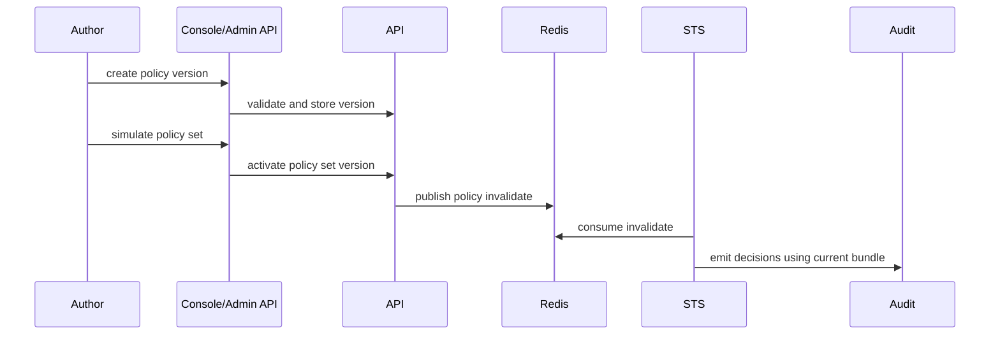

Policy changes affect STS decisions and Gateway access. Treat them as production changes with simulation, activation, audit review, and rollback readiness.

## Deployment Sequence

## Pre-Deployment

1. Confirm the policy uses current resource IDs, scopes, and canonical terminology.
2. Validate syntax and invariants through Console or Admin API.
3. Simulate expected allow and deny cases.
4. Confirm STS readiness and policy age metrics are healthy.
5. Prepare rollback policy-set version.

## Activation

Use Console `policy` and `policy set` views or Admin SDK/API automation. Do not use top-level `caracal` runtime commands for policy management.

## Verification

| Check | Expected |
| --- | --- |
| API activation response | New policy-set version is active. |
| Redis `caracal.policy.invalidate` | STS consumers receive invalidation. |
| STS policy age | Returns under alert threshold. |
| Audit decisions | Expected allow/deny records appear for canary requests. |
| Gateway behavior | Protected upstream access follows the new decision. |

## Rollback

Activate the last known-good policy-set version. Then verify STS policy freshness, canary decisions, audit records, and Gateway behavior.

## Troubleshooting

| Symptom | Check |
| --- | --- |
| Activation succeeds but decisions do not change | Policy invalidation stream, STS policy age, and STS logs. |
| Simulation differs from live decisions | Input shape, active grants, resource IDs, subject/session claims, and step-up state. |
| Policy fails closed unexpectedly | Rego compile errors, missing scope/resource, or invalid grant. |

## Next Step

Use [Upgrade Caracal](/operations/upgrade/) for image, chart, migration, and runtime configuration upgrades.
